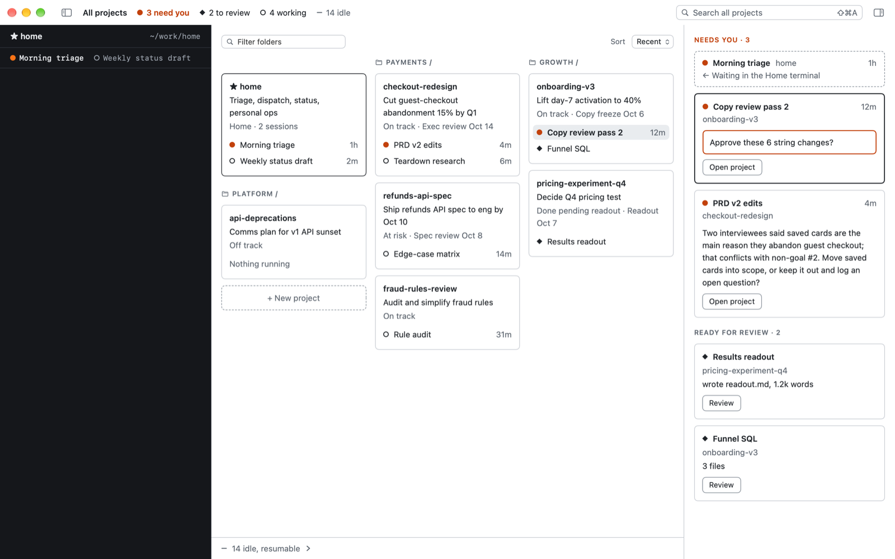

# Duo v2

A Mac app for working with Claude Code across many pieces of work at once. It keeps your projects, your Claude conversations and the documents they make in one place, and shows which conversation is waiting on you.

> **Duo v2 is an early beta and an experiment.** Things will change and some will break. Try it, and tell us what you find: open an [issue](https://github.com/dudgeon/duo-v2/issues), or use Help › Report an Issue… in Duo. Legacy Duo is in maintenance mode: it gets fixes, not new features.

Duo runs Claude Code itself, the same interactive Claude, signed in with your own Claude account. It doesn't need an API key.

## Why Duo

Claude Code can research, write and analyse with you. Once it's how you work, though, you don't have one conversation. You have a dozen: a PRD edit, competitor research, a status draft for Friday, a quick question about tax rules. They're spread across terminal windows and folders, and:

- one of them is waiting for your answer, and you can't tell which;
- you closed a window yesterday, and now you can't find that conversation;
- you started Claude on the Desktop by accident, so its files landed there too;
- Claude finished a document, and you have to go and find it to read it;
- after 30 days, Claude Code clears old conversations away for good.

## What Duo v2 is exploring

Duo v2 tests one idea: once Claude is part of how you work, organise around your pieces of work, not around chat windows and terminal tabs. Each part below is a guess, and some of them will turn out wrong. That's what the beta is for.

| What Duo tries | What we want to learn |
|---|---|
| **Every conversation in one list.** Duo reads Claude Code's own records, lists every session on your Mac by where it ran, and keeps a copy past the 30-day cleanup. | Does seeing all of them help you pick work back up, or is it noise? |
| **A folder per piece of work.** A project is a folder with a one-page `PROJECT.md`: the goal, how it's going, the next step. | Will people keep a short brief current if it's what they see every day? |
| **Context, once.** A `CLAUDE.md` at the top of your Home folder is read by every session in the projects inside it. | How much re-explaining does it save? |
| **What needs you, first.** Every question and permission Claude is waiting on, across projects, longest wait first. | Does one queue beat checking tabs? |
| **Documents beside the conversation.** Claude in the middle, the document on the right, Claude's additions highlighted. | Is reviewing Claude's work here better than in your usual editor? |
| **Two views, one click apart.** All your projects, or one of them, and search across everything. | Is a map of projects the right way to see your work? |
| **Plain files.** Projects, Home and tasks are ordinary Markdown files you can open anywhere. | Does this hold up as projects pile up? |

Tried it? Tell us what you found, good or bad.

## Install

You need a Mac with Apple silicon, macOS 26 or later, and [Claude Code](https://code.claude.com/docs/en/setup) installed and signed in.

1. Download the newest `Duo-x.y.z.dmg` from [Releases](https://github.com/dudgeon/duo-v2/releases), open it, and drag Duo into Applications.
2. Open Duo. Every Claude Code session on this Mac is already there.

**Have Legacy Duo?** Duo v2 installs as `Duo.app` too, so it replaces Legacy Duo's app. To keep both, rename the old one first (for example to `Duo Legacy.app`). See [Coming from Legacy Duo](docs/guide/coming-from-legacy-duo.md).

## Learn Duo

The [guide](docs/guide/README.md) explains Duo one idea at a time:

1. [Sessions](docs/guide/sessions.md): every conversation, found, and kept
2. [Projects](docs/guide/projects.md): one folder per piece of work
3. [Tasks](docs/guide/tasks.md) (optional): to-dos that collect their sessions
4. [Where a session belongs](docs/guide/where-a-session-belongs.md), and moving one that started in the wrong place
5. [Home](docs/guide/home.md): your projects, and a chief of staff
6. [Topics](docs/guide/topics.md): one folder per area you own
7. [Documents](docs/guide/documents.md): what Claude makes, beside the conversation
8. [What needs you](docs/guide/what-needs-you.md)
9. [Getting around](docs/guide/getting-around.md): all projects, one project, and search
10. [Plain files, and Claude driving Duo](docs/guide/plain-files.md)

Coming from Legacy Duo? Start with [Coming from Legacy Duo](docs/guide/coming-from-legacy-duo.md).

## Building Duo

See [CONTRIBUTING.md](CONTRIBUTING.md) for building from source, the checks, and where the design and planning docs are.

## Licence

MIT.
