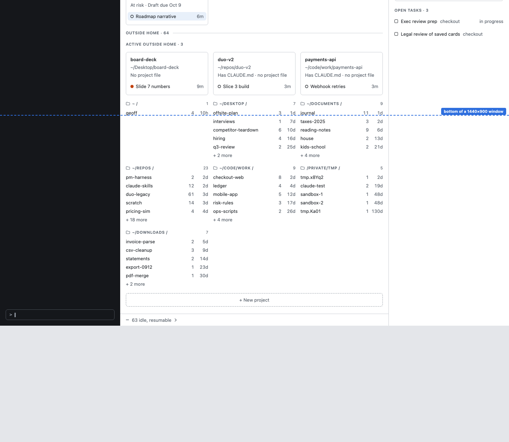
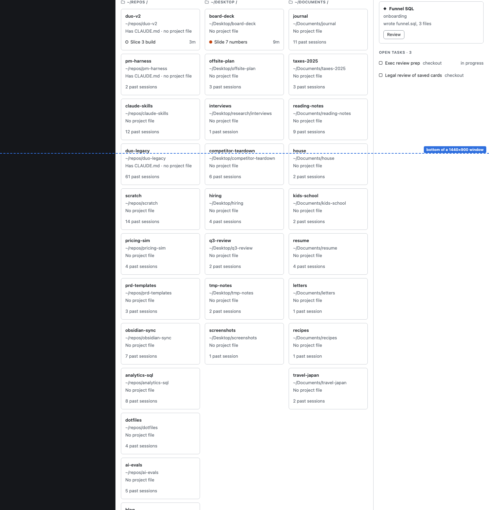
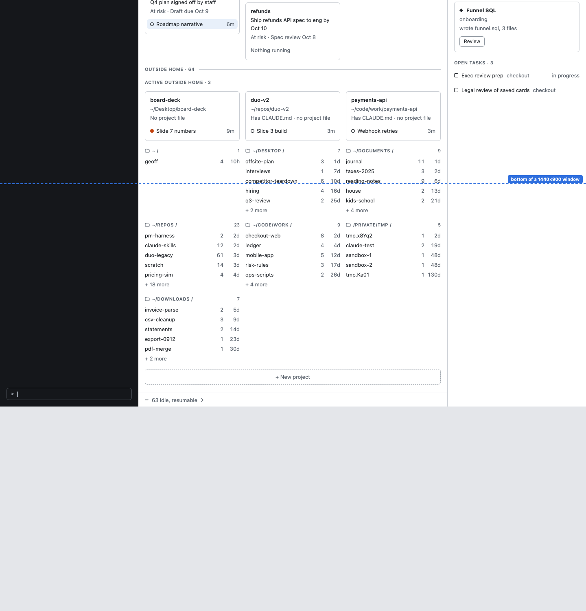
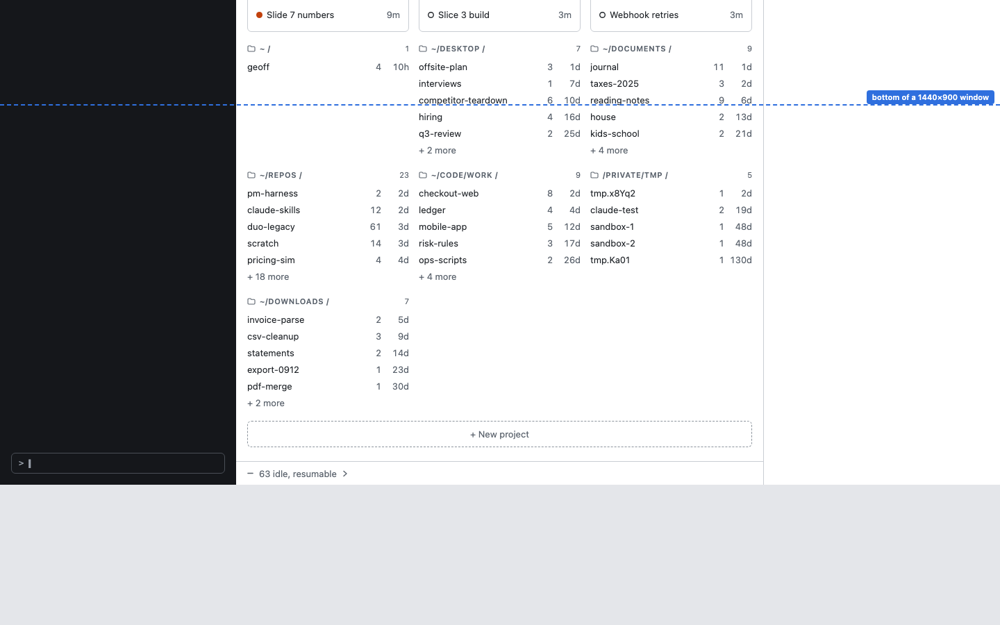
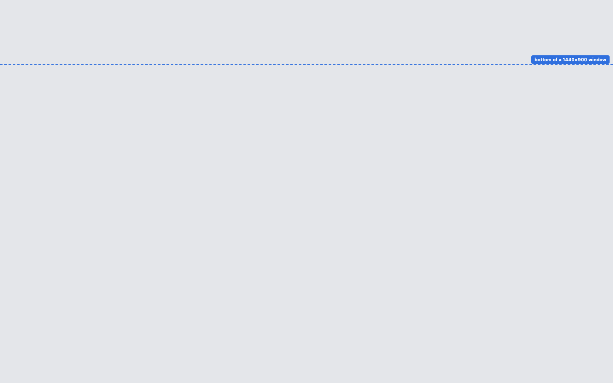
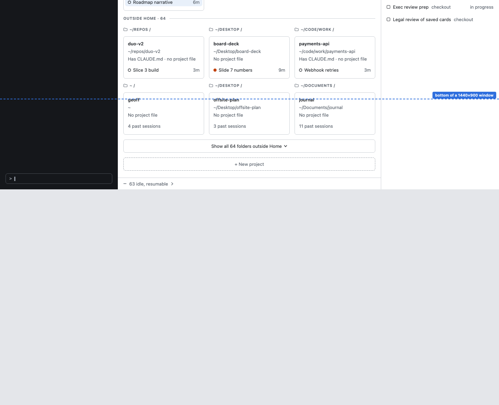
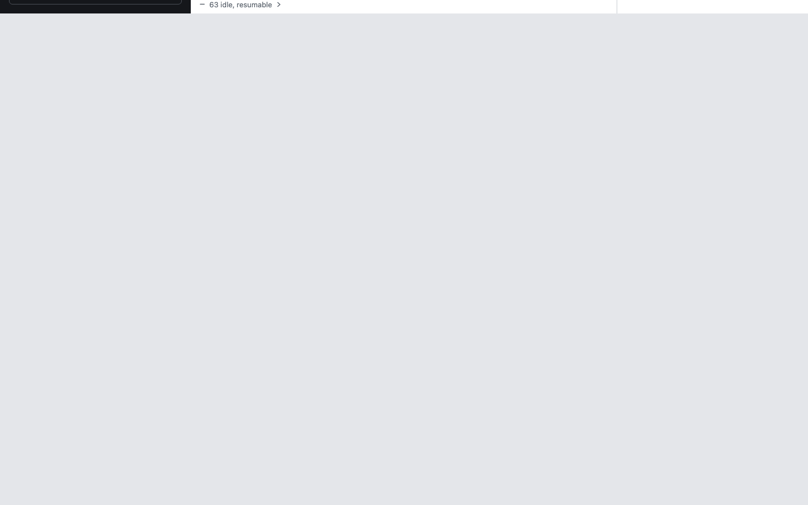
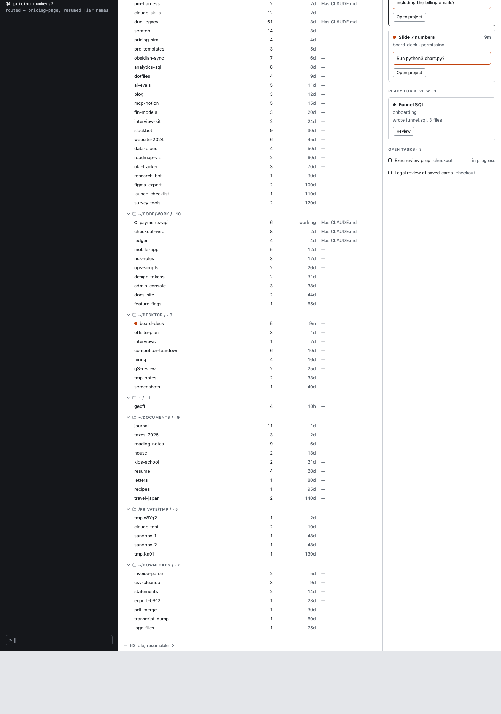

# All projects with many projects (S4-1): the boards

Captures of `../home-many-projects.html`, for reading on a phone or iPad. Every mark is [P]. Brief: `docs/design/design-brief-many-projects.md`.

**Picked (DL-101): option A with the ★ Home tile.**

## Today, with 64 folders outside Home (cut short)

## A · Tiles for Home, rows for everything else

Folders outside Home are 24-pt rows under their parent folder, 5 per group then `+ n more`. A live folder is promoted to a tile. The map header holds the filter and the sort popup. Home's card here is the full-width band; your pick swaps in the ★ tile.

The sort popup open:

Name order with `pay` in the filter:

## B · Keep the tiles, fold what's outside Home

## C · Two scopes: Home and Everywhere

## Home's card, three ways

