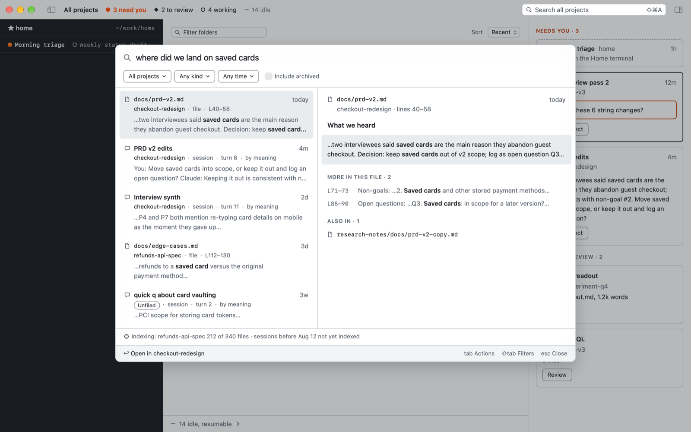

# Getting around: all projects, one project, and back

**Duo has two views: All projects, to see everything, and inside a project, to do the work. One click or one key moves between them.**

## The problem

Switching between pieces of work usually means hunting through windows and tabs, then scrolling back through a conversation to remember where you were.

## In Duo

**All projects** answers "what's in flight, and what's waiting on me?": Home's session on the left, the map of your projects in the middle, what needs you on the right. Click a project, or a session on its tile, to go inside: its sessions and files on the left, Claude in the middle, documents on the right. <kbd>⌘↑</kbd> takes you back out.

Each project reopens exactly as you left it, with the same sessions and documents in the same tabs. To find anything, press <kbd>⇧⌘A</kbd>: search covers every project, session and file, by name or by what it's about.

*Search finds projects, sessions and files by name or by meaning. Return opens the result.*

## Keys

| Keys | Does |
|---|---|
| <kbd>⌘↑</kbd> | All projects |
| <kbd>⇧⌘H</kbd> | Home, ready to type |
| <kbd>⇧⌘P</kbd> | What needs you in other projects |
| <kbd>⇧⌘A</kbd> | Search everything |
| <kbd>⌘T</kbd> | New Claude session in this project |
| <kbd>⌘D</kbd> | Send the selection to Claude |
| <kbd>⌃⌘S</kbd> | Show or hide the left pane |
| <kbd>⌥⌘0</kbd> | Show or hide the right pane |

## Good to know

- Duo works in small windows, down to a 13-inch laptop screen: the side panes keep their width and the middle flexes. Hide a side pane when you need the room.
- Duo's motion (panes sliding, sessions moving between states) follows your Mac's Reduce Motion setting.

## For power users

`duo2 go all`, `duo2 go home`, `duo2 open <project> [session]`, `duo2 search "<question>"`, `duo2 view right toggle`. Search finds meaning as well as words; `duo2 search --exact` matches exact words.

Next: [Plain files, and Claude driving Duo](plain-files.md)
