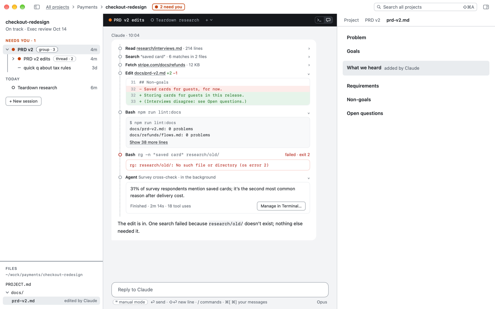

# Projects: one folder per piece of work

**A project is something you're trying to finish. It's a folder, with a one-page `PROJECT.md` as its brief: the goal, how it's going, the next step.**

## The problem

Claude works in whatever folder you start it in, and saves its files there. Start it on the Desktop and your checkout research lands next to your tax forms. A week later, neither you nor Claude knows where it went, or what the work was for.

## In Duo

Give each piece of work its own folder, with a short `PROJECT.md` in it: the goal, how it's going, and the next step. Duo shows the folder as a project: a tile on the map with its goal, health and live sessions. Open it and everything for that work is in one window: its sessions, its files, Claude, and the document you're on.

**+ New project** makes the folder and the file for you. A folder you already use can become a project with **Make a Project**.



*Inside a project: its sessions and files on the left, Claude in the middle, a document on the right.*

## Good to know

- A folder where you've used Claude but that has no `PROJECT.md` still shows, marked **no project file**. Keep working there, make it a project, or move its sessions into a project.
- A Duo project isn't the same as a project in the Claude app or ChatGPT, which collect chats. A Duo project is a piece of work with an end; when it's done, archive it and its tile folds away.
- A project can be anywhere on your Mac. Projects in your [Home](home.md) folder come first on the map.
- Health and next step are your own words. Write what you'd say in a status meeting.

### Claude is told the brief

Claude reads `CLAUDE.md` files on its own, but not `PROJECT.md`, so Duo tells it. When a session in a project starts, resumes, is cleared or compacts, Claude is given the project's name and folder and the goal, health and next step from `PROJECT.md`, in a few lines. If you change them while a session runs, Claude is told what changed with your next message, once. Only the properties are passed, not the rest of the note.

If you want Claude to have the whole of `PROJECT.md`, add a `CLAUDE.md` to the project's folder with this line in it:

```
@PROJECT.md
```

Claude Code reads the file that line names whenever it starts in that folder, and Duo then doesn't repeat the brief.

## For power users

`PROJECT.md` starts with a few properties (`type`, `title`, `status`, `goal`, `health`, `next`, `created`) and is a normal note after that.

New projects are made from a template: Duo's own, or yours. **Settings › Templates › Edit…** opens it as a document. It's `templates/new-project.md` in your Home folder, plain Markdown, and Obsidian's Templates plugin can use the same file. `{{title}}` becomes the project's name and `{{date}}` today's date. **Preview** shows what a new project would get, and **Reset…** goes back to Duo's. A template never changes a file that's already there. Duo keeps its notes about the project's sessions in `.duo/sessions.json`, and offers once to add `.duo/` to `.gitignore` in a git repository. `duo2 project new <name>`, `duo2 project make <folder>`, `duo2 project archive <project>`.

Next: [Tasks](tasks.md)
