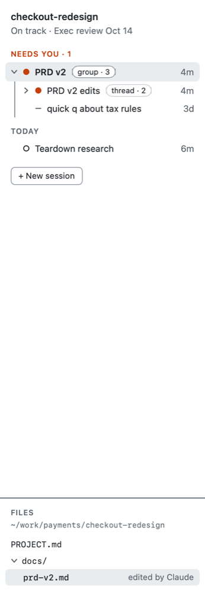
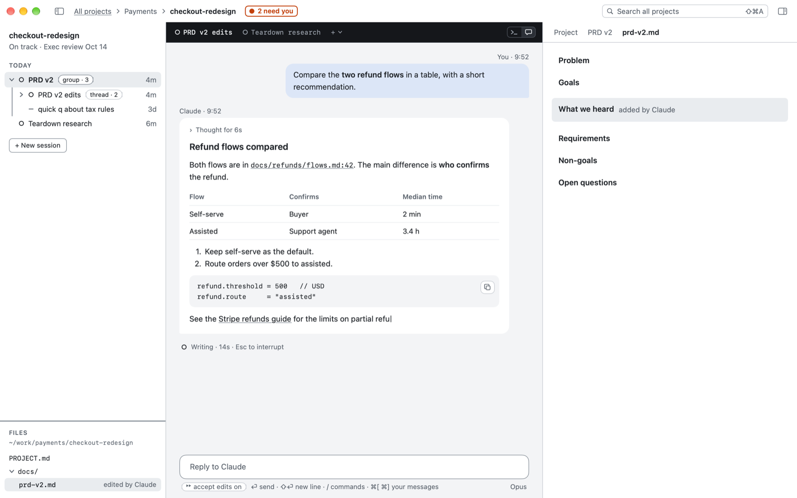

# Sessions: every conversation, found

**A session is one conversation with Claude. Duo finds every one you've had on this Mac, and keeps it.**

## The problem

In a terminal, a conversation lives as long as its window. Close the window and it's out of sight: to get it back you have to remember which folder you started it in. Run six at once and you can't see which one has stopped to ask you something. And Claude Code deletes conversations after 30 days.

## In Duo

Claude Code calls each conversation a session, and so does Duo. Duo reads Claude Code's own records, so every session shows up, including ones you started in Terminal before you had Duo. Each has a title (Claude's, or your first words until Claude names it), when you last used it, and what it's doing right now.

Click a session to open it. If it isn't running, Duo picks it up where it left off. Duo also keeps its own copy of every session it lists, so Claude's 30-day cleanup never takes one.

*A project's sessions: what needs you first, then what's open, then by when you last used it. The shape on each row is its state (see [What needs you](what-needs-you.md)).*

## Chat mode

A session runs in a terminal, Claude Code's own text window. If you'd rather read it as a conversation, click **Chat** in the pill on the session's tab bar. Claude's replies show as formatted text with clickable links, the files it edits show as changes, and its questions and permission requests show as cards with buttons. It is still the same Claude Code underneath: your answers go to the terminal as the keys you'd press, nothing is ever answered for you, and anything chat mode doesn't recognise drops back to the terminal by itself. Click **Terminal** to go back. In the reply box, `/` lists Claude Code's commands, and `@` lists the project's files and folders as you type: pick one and it goes in as `@docs/plan.md`, so Claude reads it, as when you type `@` in the terminal. Chat mode needs Claude Code 2.1.152 or later.

*Chat mode: Claude's reply as formatted text, beside the document it's working on.*

## Good to know

- Older sessions fold away under **Earlier**. Nothing is deleted unless you choose Delete Session….
- Archive a session you're done with: it leaves the lists but stays searchable, under **Archived**.
- A session can't run in two places. If it's open somewhere else (in Terminal, say), Duo tells you and offers to carry it on as a copy.
- Hover over a tab to close it. If Claude is in the middle of something, Duo asks first.

## For power users

Claude's transcripts are in `~/.claude/projects/`; Duo's copies are in `~/Library/Application Support/Duo/archive/`. `duo2 sessions` lists them and `duo2 session open <id>` opens one. Copy Link on any session gives a Markdown link like `[PRD v2 edits](duo2://session/…)`; clicking it in Duo opens the session. `duo2 session chat on|off` switches chat mode. `duo2 session new --remote-control` starts a session you can also open from the Claude app.

Next: [Projects](projects.md)
