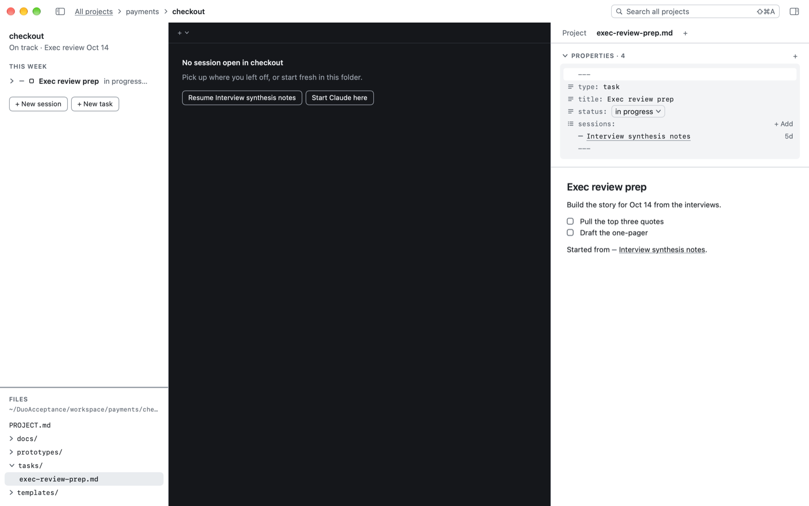

# Tasks (optional): to-dos that collect their sessions

**A task is a to-do note in a project. It keeps track of the sessions working on it.** You don't need tasks to use Duo; plenty of sessions are quick questions that don't need one.

## The problem

Real work takes more than one conversation. Getting ready for an exec review might take a research session on Monday, a draft on Tuesday and a review on Thursday. A week later, which conversations were part of it?

## In Duo

**+ New task** makes a short note in the project's `tasks` folder, with a status: open, in progress, waiting, review, done or dropped. Then link sessions to it:

- right-click a session and choose **Add to Task**, or turn it into a task with **Make a Task**;
- hover a task and click **+** to start a **New Session in Task**. Duo puts the task note into Claude's prompt, so Claude knows the job; add a word and press Return.

A session linked to a task knows it. Each time it starts, Duo tells Claude, in a few lines, which task it's working on and where the task's note is, and tells it again if the task is renamed or its status changes.

In the session list a task is one row. It shows the state of its most urgent session and folds open to the rest. Open the task to see its note, its status and its sessions, each with its live state. Right-click a task, wherever it's listed, to rename it, mark it complete, set its status, add a session, move it to another project, archive it or delete it. Mark Complete keeps the task on screen, ticked, for a few seconds so you can undo.

*A task note: its status, its sessions with their live state, then your notes.*

## Good to know

- A task with no sessions yet waits in the **Tasks** fold of the session list, and under **Open tasks** on All projects.
- Done and dropped tasks leave the lists. The notes stay in the folder.
- Archiving or deleting a task asks whether to do the same to its sessions.

## For power users

A task is `tasks/<name>.md` with `type: task`, a `status`, and a `sessions:` list of session links. It's plain Markdown, so Obsidian shows it too. Duo only ever edits the status and sessions lines (and the title, when you rename it). `duo2 tasks`, `duo2 task new`, `duo2 task add <task> <session>`, `duo2 task status <task> <status>`, `duo2 session task` (what a session is told about its tasks). Groups are a lighter, Duo-only bundle of sessions (`duo2 group new`).

Next: [Where a session belongs](where-a-session-belongs.md)
