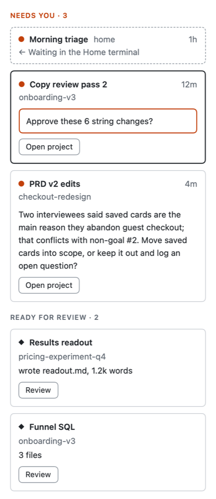

# What needs you

**Duo sorts everything by what needs you, so the one waiting on you is never buried.**

## The problem

Claude stops and waits when it has a question, needs your permission, or has a plan for you to approve. In a background window it can wait an hour before you notice.

## In Duo

Every session is in one of four states, each with its own shape, so you can tell them apart without relying on colour:

| State | What it means |
|---|---|
| **Needs you** | Claude asked a question, needs a permission, or has a plan to approve. Shows how long it has waited. |
| **Ready for review** | It finished and made something you haven't looked at. |
| **Working** | Claude is busy. |
| **Idle** | Not running, or waiting at its prompt for your next message. Pick it up any time. |

Every list puts the most urgent first, and the longest wait first within that. A task, a project and a topic each show the most urgent state of anything inside them.

On All projects, the right-hand column lists everything that needs you, with Claude's question word for word. Inside a project, a chip in the toolbar says how many need you elsewhere; click it (or press <kbd>⇧⌘P</kbd>) to see them and jump there. Duo can also send a Mac notification and badge its Dock icon; both can be turned off in Settings.

*All projects' right-hand column: Claude's questions word for word, longest wait first.*

## For power users

`duo2 needs-you` lists what's waiting, with the questions; `duo2 status` says what Duo is showing.

Next: [Getting around](getting-around.md)
