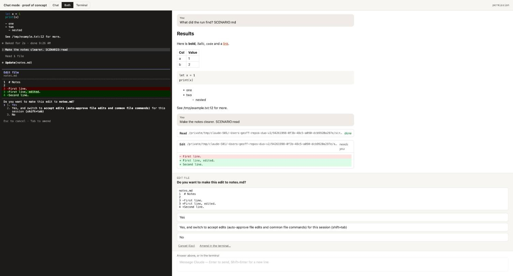
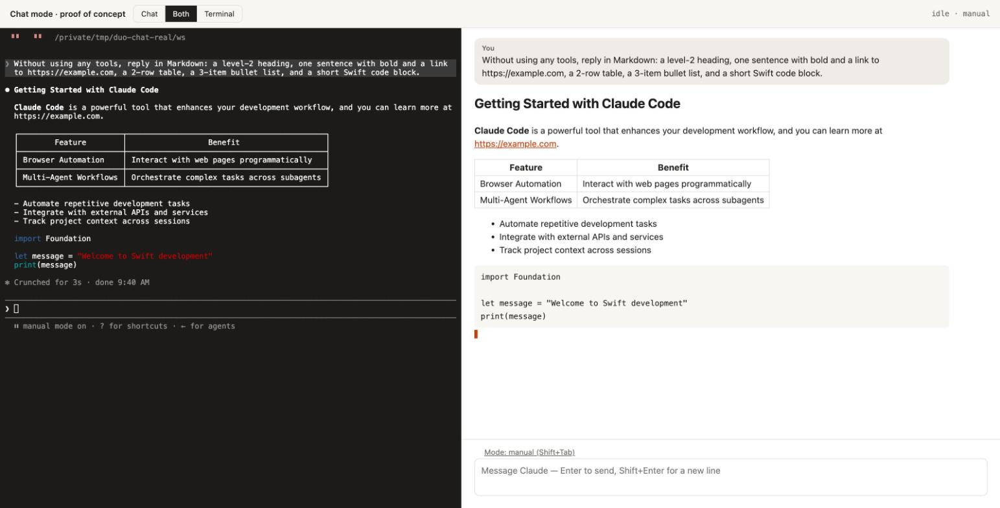
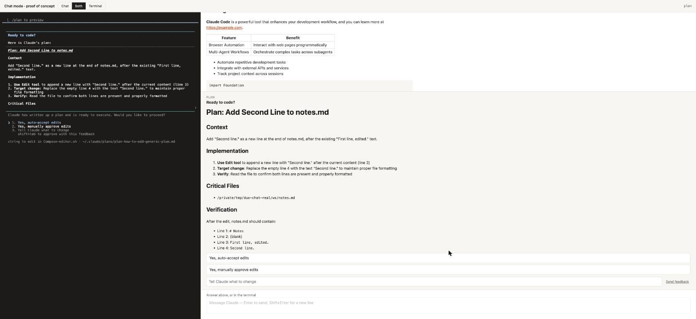
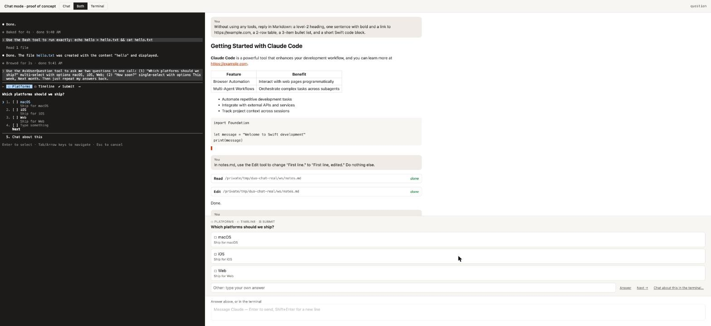
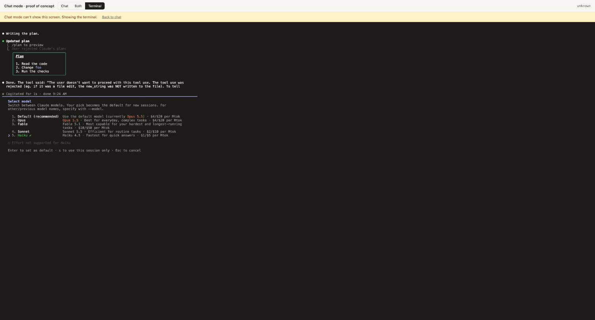
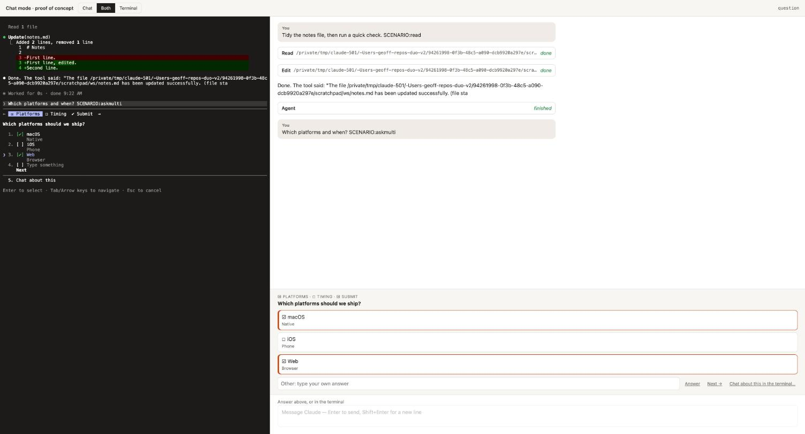
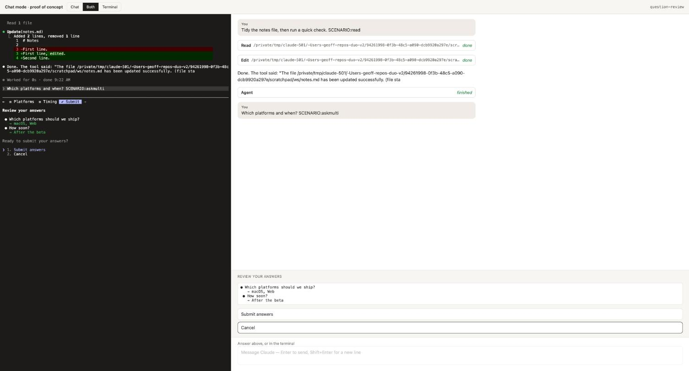
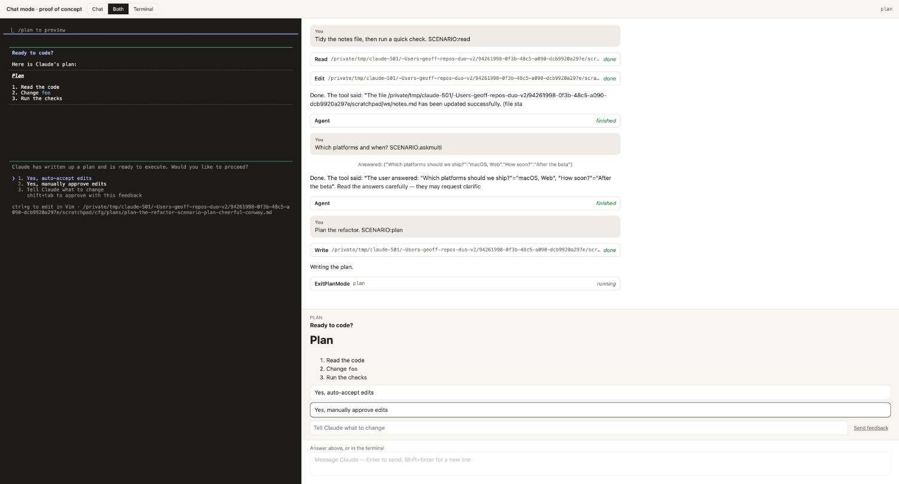

# Spike: chat mode, a readable overlay on the real Claude Code TUI

2026-10-06 · research session for the director · Claude Code **2.1.291** · binding constraints **DL-118** · records ENH-13, F-103, F-104, F-105 · proof of concept in `Spikes/chat-mode/`

## Answer

**Feasible, without screen-scraping for content, and every human choice stays in the TUI.**
- Since 2.1.152 Claude Code has a `MessageDisplay` hook that streams the assistant's raw Markdown line by line while the TUI draws it. So chat mode can render real Markdown live, not reconstruct it from the terminal.
- `PermissionRequest` carries everything a permission, plan or question card needs.
- The screen buffer is used for one job: knowing which dialog is up, its exact option labels, and what's in the input box. Answers go back as keystrokes, after a re-check that the same dialog is still on screen.
- Anything the screen reader can't name sends the user to the terminal automatically.
- Ctrl+G (Claude Code's own external-editor binding) gives a native composer that can't get out of step with the TUI's input.

**Chat mode needs only the Claude Code CLI login**: the subscription login a user already has for `claude`. No API key, no `ANTHROPIC_BASE_URL`, no SDK, no `-p`. Everything it reads comes from the user's own interactive `claude` (hooks loaded per session with `--settings`, the transcript, the terminal screen), and everything it sends is keystrokes into that same process. This was confirmed with real Haiku turns under Geoff's normal CLI login ("Haiku 4.5 · Claude Max" in the TUI header). See [Real turns under the CLI login](#real-turns-under-the-cli-login-f-105). The mock API below is only a test fixture for developing and checking chat mode; users never run it.

Recommended shape: **render from hooks, check dialogs against the screen, answer with keys, compose through Ctrl+G.** Fall back on anything unrecognised, and gate dialog answering per CLI version with the mock-API tour below as the test.



## How it was verified

The real interactive TUI ran on a PTY with a headless xterm mirror of the screen (`Spikes/chat-mode/drive.mjs`):
- `claude` 2.1.291, Duo's own kind of per-session `--settings` hooks, a scratch `CLAUDE_CONFIG_DIR`.
- It was pointed at a **local mock of the Messages API** (`mock.mjs`, via `ANTHROPIC_BASE_URL` and a dummy key the scratch config pre-approves).

The mock answers each prompt from a script (`SCENARIO:ask`, `askmulti`, `read` (then edit), `plan`, `agent`, `long`, `err`, `bash`, `md`), so every dialog came up on demand. That needed **no credentials and no tokens**, and nothing touched Geoff's config. Real turns under the CLI login came later and are in their own section below (F-105).

Every claim below has a screen dump (`Spikes/chat-mode/screens/`) or a hook log behind it. The page PoC was then driven in Chrome, and the screenshots here come from it.

## Real turns under the CLI login (F-105)

The test ran exactly as a user would, with Geoff's go-ahead through the director:
- plain interactive `claude` under his normal CLI login (his default config);
- no `ANTHROPIC_API_KEY` or `ANTHROPIC_BASE_URL` anywhere, and no credentials read or copied;
- `--model claude-haiku-4-5-20251001` in a throwaway folder (`/tmp/duo-chat-real/ws`);
- hooks only through the PoC's per-session `--settings` file; no global setting touched.

About 10 short turns over two sessions (8 prompts plus plan feedback and a revised plan), both archived afterwards with `duo2 session archive`. Every answer except the trust prompt was given from the PoC page. One extra prompt reached session 1 by mistake (my script talked to a server I thought I'd stopped); it was interrupted and isn't counted below.

| Turn | Result |
|---|---|
| First run in the new folder | The trust prompt ("Is this a project you created or one you trust?") read as `unknown`: **fell back to the terminal**, answered there, and chat returned by itself |
| Markdown reply | Streamed through `MessageDisplay` (10 flushes, about 0.1 s apart), rendered as heading, link, table, list, code |
| Edit permission | Dialog **identical to the mock baseline**; "Yes" from the card applied the edit |
| Bash permission | Identical signature. The `permission_suggestions` field said `destination: session` while the TUI's option read "Yes, and always allow access to … from this project", which is why labels come from the screen |
| AskUserQuestion, two questions, multi-select + Other | Identical layout (`☐ Platforms ☐ Timeline ✔ Submit`, descriptions, "Type something", "Chat about this"). macOS + Web toggled, Next, "After the beta" typed as Other, review page, "Submit answers". Claude replied "Platforms: macOS, Web / Timeline: After the beta" |
| Plan approval | Identical options. The real plan is longer than the TUI's dialog shows (it cuts off with a scroll mark); the card showed all of it. Option 3 feedback reached Claude as `userFeedback`; Claude revised the plan. Option 2 ("manually approve edits") led to an edit permission, answered "Yes" |
| Interrupt | Stop (Esc) from the page; the TUI showed "Interrupted · What should Claude do instead?" |
| Ctrl+G compose | Half-typed text in the TUI went to the stand-in editor; the composed text came back into the input; Enter; Claude replied "composed" |

Hooks fired as they do with the mock: `SessionStart`, `UserPromptSubmit`, `MessageDisplay`, `PreToolUse`, `PostToolUse`, `PermissionRequest` (Edit ×2, Bash, AskUserQuestion, ExitPlanMode ×2), `Notification` (`permission_prompt` and `idle_prompt`), `Stop`, `SubagentStop`. Nothing in the design needs an API key.

**Differences from the mock baseline** (`Spikes/chat-mode/screens/real-cli-login-2.1.291/` vs `tour-2.1.291/`):
1. **A named session writes its name into the input box's top rule** (`──── add-second-line-notes ─`). The mock's sessions never got one. The PoC's rule pattern didn't allow it, so every screen after naming read as `unknown`. Fixed in `screen.mjs`; the baseline still reads the same.
2. **Concurrent hooks interleaved in the events file.** The final `MessageDisplay` and `Stop` fire together; with real ~1 KB payloads, `sh`'s `printf` wrote in pieces and the two lines merged, so both were lost and the reply never got its end. The PoC now writes each event with one `syswrite` (O_APPEND); a mock re-run had 0 bad lines. Duo's own hook command (`HookEvents.swift`) has the same weakness (F-23 already skips bad lines).
3. **An interrupted text reply fires no hook at all**: no final `MessageDisplay`, no `Stop`, no `PostToolUseFailure`. Only the screen (busy → idle, "Interrupted") says the reply ended. The PoC now closes an open reply on busy → idle.
4. **The screen is blank for a moment** at start and while the external editor runs (Ctrl+G), and both read as `unknown`. The fallback now waits 500 ms for `unknown` to persist.
5. Cosmetic, no effect on reading: the header says "Claude Max" (vs "API Usage Billing"); a "Tip:" line can sit under the spinner; the spinner shows "thinking" / "thought for 1s"; the plan dialog names the editor ("ctrl+g to edit in Compose-editor.sh").





## Sources of structured truth (verified)

| Source | What it gives | Latency (measured) | Verdict |
|---|---|---|---|
| **Hooks** (per-session `--settings`, as Duo does today: `HookEvents.swift`) | `UserPromptSubmit` (prompt, `source`: user / system / loop…), `PreToolUse`/`PostToolUse` (tool_use_id, input, response, duration), `PostToolUseFailure` (`is_interrupt`), `PostToolBatch`, **`PermissionRequest`** (tool_name, full tool_input, `permission_suggestions`; **no tool_use_id**), `SubagentStart`/`SubagentStop` (agent_id, `agent_transcript_path`, last message), `PreCompact`/`PostCompact`, `Stop` (`last_assistant_message`), `StopFailure`, `Notification` (6 s after a dialog appears), `SessionStart` (`transcript_path`), **`MessageDisplay`** (see below). | Immediate: written as each event happens | **Primary source.** All observe-only: Duo's hooks print nothing. |
| **`MessageDisplay` hook** (2.1.152) | Per flush while assistant text streams: `message_id`, `index`, `final`, `delta` = the newly completed **raw Markdown** lines. | 40-line answer: line 1 at +0.30 s, then one flush per line, final at +10.9 s | **The streaming source.** Caution: the hook can also *transform or hide* displayed text (changelog 2.1.152), so it must print nothing, and each flush runs the hook synchronously. |
| **Transcript JSONL** (`~/.claude/projects/<bucket>/<id>.jsonl`) | One line per **content block**, written when the block completes: text, thinking, tool_use, tool_result (with `toolDenialKind`, `userFeedback` on refusals), attachments, compaction, mode changes, `ai-title`. Subagents: `<id>/subagents/agent-*.jsonl`. | The same 40-line answer landed at +10.99 s, all at once. In this session, assistant lines landed a median 2.9 s after their timestamp (max 126 s for a large tool call). | **The record**: history before chat mode attached, resume, and what hooks don't carry (thinking, refusals, plan feedback). Not for streaming. |
| **Screen buffer** (SwiftTerm in Duo; xterm headless in the PoC) | Which dialog is up and its **exact option text**, the cursor row, multi-select checkmarks, question tabs, the input box's contents, mode (manual / accept edits / plan), busy (`esc to interrupt`), spinner and retry status. | Settles about 60 ms after a burst | **Only for dialog state and the input box.** Read cell attributes, not just text: the input placeholder (`Try "fix lint errors"`) is dim text and reads as typed input. |
| **IDE bridge** (`~/.claude/ide/*.lock`, websocket MCP; `openDiff` → `FILE_SAVED` / `DIFF_REJECTED` / `TAB_CLOSED`, `selection_changed`, `at_mentioned`) | What VS Code and JetBrains use beside the real TUI: diffs, selection, diagnostics. | Not measured | **Exists; not tried.** A later option: Duo as the "IDE" would get edit diffs and send the editor selection. Undocumented protocol (only the lock file and env vars are mentioned). |
| **Statusline** (`statusLine.command` stdin JSON) | Model, cost, context window, rate limits, output style, worktree, session name. Event-driven, debounced 300 ms. | — | Useful for a chat-mode header. Optional. |
| Output styles, settings | Change what Claude says, not how the TUI is drawn. | — | Not needed. Don't use them for chat mode: they would change Claude's behaviour. |

**Ruled out** (DL-118 §1): `-p`, `--output-format stream-json`, `--input-format`, the Agent SDK and ACP. They change how Claude runs and replace the TUI's review.

## Capability matrix

Faithful = chat mode shows the same choices and information and the answer reaches the TUI as keys. Partial = what's lost is named. Fallback = Duo shows the terminal.

| Interaction | Data source | Input path (keys into the PTY) | Verdict |
|---|---|---|---|
| User's prompt | `UserPromptSubmit` (echo), transcript | Composer → Ctrl+G external editor (recommended) or bracketed paste into an empty input, then Enter | **Faithful**, with the input guard below |
| Streaming assistant text | `MessageDisplay` live, transcript final | — | **Faithful.** Line-granular, as the TUI. Render soft line breaks as breaks: the TUI does. |
| Thinking | Transcript `thinking` blocks | — | **Partial**: shown when the block completes (often redacted); no live thinking |
| Tool calls and results | `PreToolUse`/`PostToolUse`, transcript | — | **Faithful** as cards. The TUI's own groupings ("Read 1 file") and Ctrl+O expansions aren't reproduced; chat mode shows every call |
| File edits and diffs | `PreToolUse`/`PermissionRequest` tool_input (old/new, content), `PostToolUse` `structuredPatch` | — | **Faithful** (Duo renders the diff; the TUI's line numbers come from the screen if wanted) |
| Permission prompt: allow once / always / deny | `PermissionRequest` (what) + screen (the **verbatim option labels**, e.g. `2. Yes, and always allow access to <dir> from this project`, `2. Yes, and switch to accept edits … (shift+tab)`) | The option's digit (verified for 1–3); Esc = cancel | **Faithful** when buttons are built from the screen's labels, never a fixed list. **Tab to amend** (feedback text) → fallback for now |
| Plan approval (`ExitPlanMode`) | `PermissionRequest.tool_input.plan` (Markdown) + `planFilePath`; screen "Ready to code?" with `1. Yes, auto-accept edits` / `2. Yes, manually approve edits` / `3. Tell Claude what to change` (+ "shift+tab to approve with this feedback"); auto mode adds "Yes, and use auto mode" (changelog 2.1.280) | Digit or arrows + Enter; 3 = arrows to it, type, Enter (**verified**: Claude received "the user said: Also update the docs") | **Faithful** for 1–3. "Approve with this feedback" (shift+tab on 3) and Ctrl+G-to-edit the plan → fallback. A refused plan fires **no hook**: only the transcript's `toolDenialKind: user-rejected` and `userFeedback` say so |
| AskUserQuestion, single | `PermissionRequest.tool_input.questions[]` + screen | Arrows from the cursor row, Enter (**verified**) | **Faithful** |
| AskUserQuestion, multi-select, several questions, "Type something" (Other), review page | Same; the screen gives the tab strip (`☐ Platforms ☐ Timing ✔ Submit`), `[✔]` marks and "Review your answers" | Space toggles, → moves to the next question, type into "Type something", Enter; then "Submit answers" (**all verified**, end to end from the page) | **Faithful**, as long as the card mirrors the TUI's own steps and re-reads the screen after every key. Esc = "User declined to answer questions" |
| AskUserQuestion "Chat about this", option `preview` panes, notes | Screen | — | **Fallback** (preview: until designed) |
| /commands | Screen (the menu filters as you type) | Typed into the input | **Partial**: the composer can offer the list; any command with its own UI (`/model`, `/config`, `/permissions`, `/resume`, `/agents`, `/mcp`, `/tasks`) → **automatic fallback** (verified with `/model`) |
| Errors and retries | `StopFailure`; screen status (`529 Overloaded · Retrying in 2s · attempt 4/10`) | — | **Faithful** as a status line |
| Interrupt | `PostToolUseFailure.is_interrupt`; screen "Interrupted · What should Claude do instead?" | Esc (verified) | **Faithful** |
| Compaction | `PreCompact`/`PostCompact`, transcript compact boundary | `/compact` typed | **Faithful** (a divider). The TUI prints hook names after compaction; hide them |
| Subagents and background agents | `SubagentStart`/`SubagentStop` + `agent_transcript_path`; screen "Backgrounded agent (↓ to manage)" | — | **Partial**: a card with the agent's final message; its live transcript is readable, but the ↓ manager and `/tasks` → fallback. Claude's own side agents emit `SubagentStop` without a start; ignore those |
| Task notifications, loop / schedule wakeups | `UserPromptSubmit` with `source` ≠ user or `<task-notification>` | — | **Faithful** as a quiet system line, not a user bubble |
| Mode (manual → accept edits → plan) | Screen footer | Shift+Tab (verified) | **Faithful** (a mode chip) |
| Typing while Claude works | Screen | Composer as usual | **Faithful**: the TUI queues the message; show it as queued |
| Images pasted into the prompt, `@` file completion, history (↑) | Screen | — | **Partial**: `@` paths can be typed as text; image paste and history recall → terminal for now |
| First-run, login, API-key, trust and update screens; MCP elicitation; anything unrecognised | Screen = `unknown` | — | **Automatic fallback** (verified: the API-key prompt and `/model` both read as unknown) |

## Input: the composer

Three options:

1. **Paste on send.** A native text field; on send, check the TUI's input box is empty, then bracketed paste and Enter.
   - Native editing, IME, spellcheck and VoiceOver.
   - The TUI's input has state of its own, and two desyncs were reproduced:
     - After Esc, Esc the TUI kept `/mod`, and the next send became `/modSCENARIO:long` → "Unknown command".
     - Ctrl+U clears only one line of a multi-line input.
     - The dim placeholder also reads as text unless attributes are checked.
   - So paste only into an input the screen shows empty (non-dim cells), and confirm the echo with `UserPromptSubmit`. Otherwise show the terminal.
2. **Mirror the TUI's input**: render its line natively and forward every key. Always in sync, but it is the terminal's editing with a different font. Little gain.
3. **Recommended: Ctrl+G as the bridge** (`chat:externalEditor`; also `ctrl+x ctrl+e`). Verified:
   - With `EDITOR` set to a stand-in, Ctrl+G handed the TUI's current input ("half-typed in the TUI") to the editor as `/tmp/claude-…/claude-prompt-<id>.md`.
   - The TUI took back the replacement, multi-line, exactly. Enter sent it.
   - So Duo's composer *is* Claude's external editor. It always starts from the TUI's real buffer, and the TUI stays the owner, so there's nothing to keep in step.
   - The same binding opens AskUserQuestion's "Other" field (2.1.9) and the plan feedback field.
   - Cautions:
     - `EDITOR` is inherited by Claude's Bash tool (a `git commit` would open it). The helper must act only on `claude-prompt-*.md` and `exec` the user's own editor otherwise.
     - A user keybinding can move Ctrl+G; Duo reads `~/.claude/keybindings.json`.
     - 2.1.269 fixed a double draw after returning from the editor, so gate the bridge to ≥ 2.1.269 and use option 1 below that.

## Recommended architecture

```
Claude Code TUI (PTY, unchanged) ──bytes──▶ SwiftTerm view (terminal, always alive)
   │  hooks (print nothing) ──▶ events/<id>.jsonl ──┐
   │  transcript JSONL ─────────────────────────────┤──▶ ChatModel (@Observable): turns, tool cards,
   │                                                │      streaming Markdown, pending request
   └─ SwiftTerm buffer ──▶ ScreenReader(version) ───┘──▶ DialogState: idle | busy | permission |
                                                          plan | question | review | unknown
ChatView (WKWebView or native) ◀── ChatModel + DialogState
  answer(sig, keys) ──▶ re-read screen; same sig? ──▶ keys into the PTY ──▶ TUI decides
  composer ──▶ Ctrl+G ──▶ duo2 editor helper ⇄ composer ──▶ Enter
```

- **Same session, same process.** Chat mode is a second view on the terminal Duo already runs. Toggling never restarts anything. The terminal view keeps receiving bytes while hidden.
- **Hooks**: extend Duo's existing per-session settings (`HookEvents.names`) with `PreToolUse` (all tools, not only Edit|Write), `PostToolUseFailure`, `SubagentStart`/`Stop`, `Pre`/`PostCompact`, `StopFailure` and `MessageDisplay`. They keep printing nothing.
  - `MessageDisplay` spawns a shell per flush. Measure the cost on long answers, and prefer a single small helper (or an `http` hook to a loopback port) over `sh` + `perl`.
  - Hooks only append to a file, so Duo never answers: the hook-decision route (`PermissionRequest` returning allow/deny) would *replace* the TUI's dialog, which DL-118 rules out.
- **ScreenReader is versioned**: a table of dialog signatures per CLI version. The PoC's `screen.mjs` is about 90 lines and covers every dialog above for 2.1.291.
- **Chat rendering**: the editor already runs a web view with Markdown (F-25: web views must be checked in a browser at the pane's width). Chat mode can reuse that stack: links clickable, file paths opening in Duo.

## Fallback rules

Chat mode shows the terminal, with a one-line reason and "Back to chat", whenever:

1. **The screen stays `unknown` for 500 ms** (a blank screen at start or during Ctrl+G is not a reason): no input box and none of the known dialog signatures. This covers first-run, login, trust, API-key, update notices, `/model`, `/config`, `/permissions`, `/resume`, `/agents`, `/mcp`, `/tasks`, elicitation, Vim mode, fullscreen mode and anything new.
2. **The screen and the hooks disagree**: a permission dialog with no pending `PermissionRequest` (or one for a different tool), or a plan or question screen whose text doesn't match the request's.
3. **A signature matched but the CLI version isn't one the dialog table was verified on.** Rendering continues; dialogs go to the terminal.
4. **The answer can't be delivered**: the screen changed between drawing the card and sending (signature check), the input wasn't empty, or the echo didn't match.
5. **The user picks something chat mode doesn't do**: Tab to amend, Chat about this, preview panes, Ctrl+O, the agents manager.

When the screen returns to the idle or busy input box, chat mode comes back by itself if it left by itself. If the user chose the terminal, it stays. The toggle (header control, a shortcut) works at any moment, both ways.



## Prior art

| Tool | Data | Input | Overlays the real TUI? |
|---|---|---|---|
| opcode (Claudia) | `-p` stream-json | new `-p` per turn; `--dangerously-skip-permissions` | No: ruled out |
| Crystal (now Nimbalyst) | `-p` stream-json in node-pty | `--permission-prompt-tool` MCP | No: ruled out |
| Official VS Code panel | SDK control protocol (stream-json, `can_use_tool`) | SDK | No; its "Use Terminal" mode runs the TUI instead |
| VS Code terminal mode, JetBrains | Real TUI + IDE MCP bridge (diffs, selection) | User's keys | Augments; doesn't re-render |
| CloudCLI / Claude Code UI, claude-code-viewer | Agent SDK; JSONL for history | SDK | No: ruled out |
| Zed ACP adapter, Vibe Kanban | SDK / stream-json | ACP / stdin | No: ruled out |
| Happy | Local: real `claude` on inherited stdio + SessionStart hook; remote: SDK | Switches process when the phone takes over | Half |
| **Omnara v1** (removed 2026-08) | PTY + **JSONL tail** + **screen-scraped prompts** | Digits and `\r` into the PTY | **Yes**: the closest precedent. It matched strings ("Do you want", "No, keep planning") and hard-coded Yes / Yes-don't-ask / No, then was dropped in a relaunch. A warning about upkeep. |
| Claude Squad, cmux, Warp | tmux capture / hooks / notifications | send-keys / user | Chrome around the TUI; no re-rendering |

**Lessons:**
- Every rich chat GUI uses `-p` or the SDK, and the official extension also gives up the TUI for its GUI. Nobody ships a faithful overlay.
- Omnara's failure points (fixed option lists, timing guesses, JSONL lag) are exactly what `MessageDisplay`, `PermissionRequest`, verbatim screen labels and signature re-checks replace here.
- Issue #38299 reports keys sent too fast being dropped. In this spike, keys 80 ms apart were all taken. Keep a pace and re-read after each key.

## Risks

| Risk | Likelihood | Impact | Mitigation |
|---|---|---|---|
| **TUI churn** (C-1, the CONS PRD §11 version gates): dialog wording, layout, option order change between releases (2.1.280 added an auto-mode plan option; 2.0.55 removed a review step) | High | Wrong card, or worse a key landing on the wrong option | Versioned signatures; unknown → fallback; answers re-check the signature and use the screen's own labels; **the mock tour (`tour.sh`) runs every dialog against each new CLI in under 30 s, without tokens, to diff against `screens/tour-2.1.291/`**: make it a check per release |
| A keystroke reaches the wrong place (dialog closed between card and key) | Medium | A stray digit in the prompt (seen: `2SCENARIO:plan`) | Signature re-check right before sending; digits only while that dialog is up; one key at a time with re-reads |
| Input desync (leftover text, placeholder, queued prompts) | Medium | Glued or lost prompts | Ctrl+G bridge; empty-input guard with dim-cell check; echo check |
| `MessageDisplay` hook cost, or misuse | Low–medium | Slower text on screen; a printing hook would *change* what the TUI shows | Print nothing; measure; one small helper; drop to transcript-only rendering if disabled by managed settings |
| Managed settings disable hooks (`disableAllHooks`, work Mac policy) | Medium on the work Mac | No streaming, no requests | Detect (no `SessionStart` event) → chat mode unavailable for that session, terminal only |
| Work Mac CLI 2.1.219 | Certain | — | Has `MessageDisplay` (2.1.152), `StopFailure` (2.1.78), `PostCompact` (2.1.76). **Lacks** 2.1.285's fix for hooks seeing a stale plan on `ExitPlanMode` (read the plan from `planFilePath`) and 2.1.269's Ctrl+G redraw fix (use paste-on-send there). Dialog signatures unverified there: rendering only until the tour runs on 2.1.219 |
| Fullscreen renderer, Vim mode, user keybindings | Medium | Layout or keys differ | Fullscreen/Vim → unknown → fallback; read `keybindings.json` for Ctrl+G, Esc, Enter |
| Sandbox | Low | Hooks run outside Claude's sandbox (they're Claude Code's own commands), so writing to Duo's events folder works as today (F-23) | None needed. The Ctrl+G helper runs as Claude's child, outside the Bash sandbox |
| Latency | Low | Screen settles ~60 ms; hook lines arrive as written; answers are keys | — |
| **Losing information** | Medium | The TUI shows things no source carries: spinner tips and token counts, groupings, Ctrl+O expansions, the statusline, background-task panel, prompt suggestions, mod rows above the prompt, hook output lines | "Both" view and the one-key toggle; list what's dropped in the design; never hide a dialog |
| Accessibility | — (an opportunity) | A chat log with a live region reads far better under VoiceOver than a terminal grid | Cards must be keyboard-operable in the TUI's order; announce new dialogs (`aria-live` / NSAccessibility notifications) |
| Hook lines lost when hooks fire together (seen with real payloads, F-105) | High without a fix | A reply never ends; an event missed | One `write(2)` per event with O_APPEND (a small helper, not `sh` + `printf`); fix Duo's existing hook command the same way |
| One session, two writers | Low | — | There is only ever one: the TUI. Chat mode never runs Claude itself |

## The proof of concept

`Spikes/chat-mode/` (Node; not part of the app). It contains:
- `server.mjs` runs `claude` in a PTY with hooks, tails the events and the transcript, reads the screen (`screen.mjs`), and serves `index.html`.
- `index.html` shows the real terminal (xterm.js) beside the chat: Markdown from `MessageDisplay`, tool cards with diffs, permission, plan and question cards drawn from the screen and the request, a composer, a mode chip, Stop, the Chat / Both / Terminal toggle, and the automatic fallback.
- `mock.mjs` is the scripted API.
- `drive.mjs` / `tour.sh` play a scenario headlessly and dump screens; `scenario-tour.json` is the one used here.
- `screens/` holds the captured TUI states.

```
cd Spikes/chat-mode && npm install && find node_modules/node-pty -name spawn-helper -exec chmod +x {} \;
./start.sh            # mock: http://127.0.0.1:8780, type e.g. "Plan it SCENARIO:plan"
./start.sh --real     # your login, a throwaway workspace, Haiku (spends tokens)
./tour.sh scenario-tour.json /tmp/tour
```

What it shows working, end to end from the page:
- streamed Markdown;
- an edit permission answered with "Yes" (the TUI then shows "Added 2 lines, removed 1 line");
- a two-question AskUserQuestion with multi-select, "Other" free text and the review page;
- a plan approval card, and plan feedback sent with option 3;
- `/model` falling back to the terminal and returning when it closes.

It answers through the composer as paste-on-send. The Ctrl+G bridge was verified separately with `tour.sh`. The PoC is a spike, not a design: its look is neutral stand-ins.





## Open questions

- ~~Real turns~~: done, under the CLI login (F-105). A longer real session would also show compaction and subagents with a real model; the mock covered both.
- **Ctrl+G in the build:** confirm `EDITOR` vs `VISUAL` precedence and what Claude's Bash tool inherits. Then decide between a `duo2 compose` helper and an env var Claude might add.
- **IDE bridge** as a later source of diffs and selection: a separate spike.
- **Rendering stack**: reuse the editor's web view (Markdown, links, code) or go native. A design-session question (DL-119).
