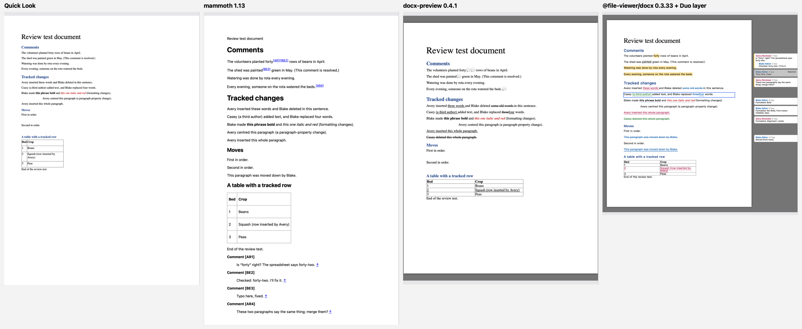
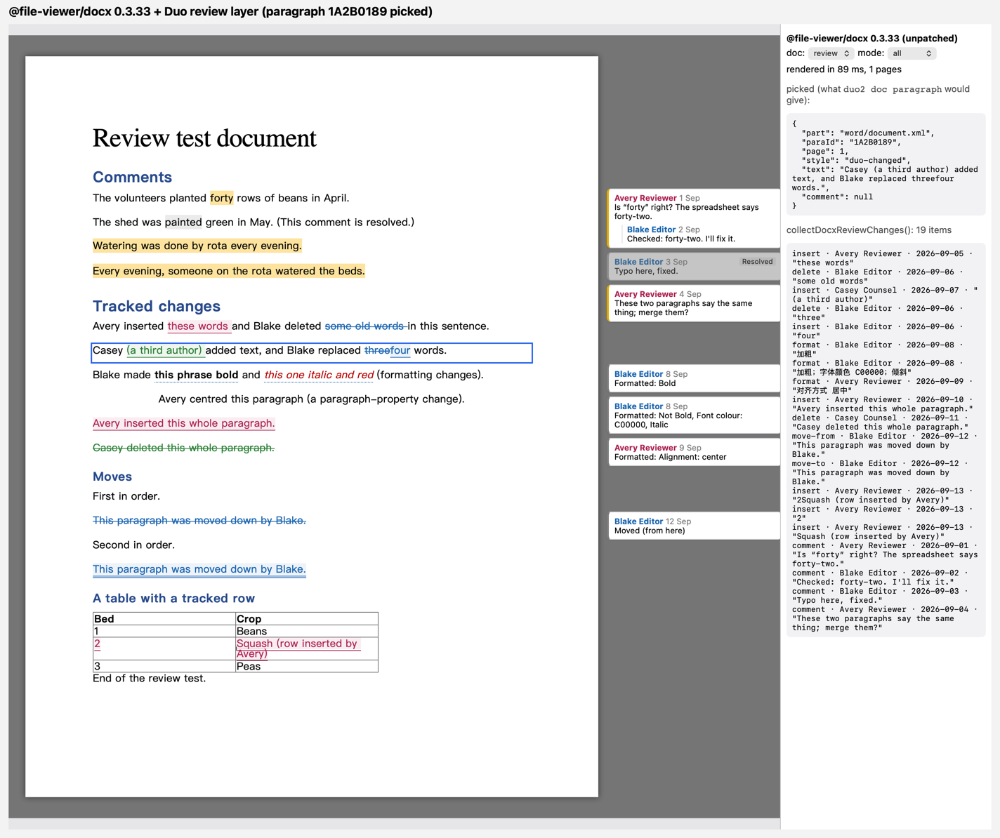
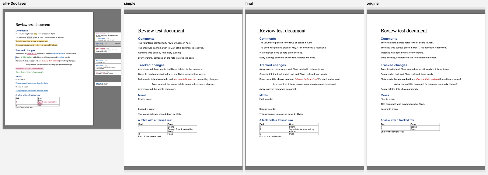
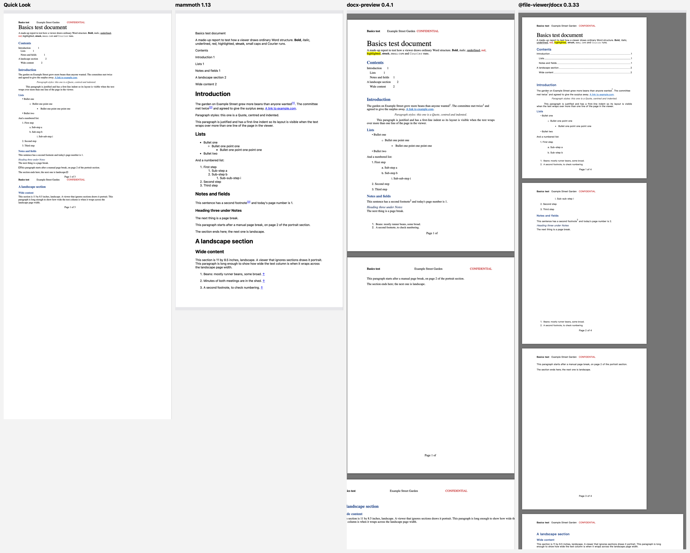
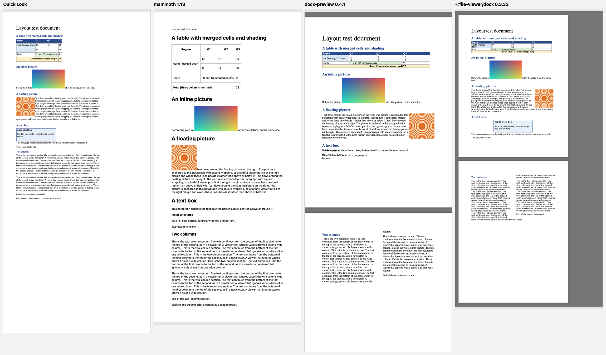

# Spike: a view-only Word viewer in Duo

Status: **research, waiting on Geoff** · 2026-10-08 · follows DL-121/DL-125 (the PowerPoint viewer) and DL-123 (Convert to Markdown)

**The requirement (Geoff, 2026-10-08):** when a user opens a .docx, Duo offers two things:
- **Convert** to Markdown, which may lose things. This is DL-123 as built.
- **View only**, drawn the way decks are. View only must keep and show comments, tracked changes and the rest.

What view only must do:
1. Show the document faithfully. That means comments (author, date, the range highlighted, replies, resolved state) and tracked changes (insertions, deletions, formatting changes and moves, each with author and date, coloured per author). It also means footnotes and endnotes, headers and footers, tables with merged cells, inline and floating images, lists, styles, page breaks and sections, and fields such as a TOC.
2. Let the user pick a paragraph or a comment and send it to Claude, as Select Shape does for decks.
3. Let Claude read the same document from the file: an outline with paragraph ids, the comments and the changes.

**Recommendation:** render with **`@file-viewer/docx` 0.3.33** in a web view, hosted the way `DeckViewer` hosts decks.
- **What it is:** a maintained Apache-2.0 fork of docx-preview. It is 279 KB plus JSZip (≈106 KB gzipped together) and fully offline.
- **Paragraph ids need no patch.** Its `exposeDisplayTargets` option stamps every `<p>` with `data-office-target="word/document.xml#p:<w14:paraId>"`. That includes headers, footers, footnotes and table cells.
- **Review views are built in.** It has four of them (`all`, `simple`, `final`, `original`). Every insertion, deletion, move and formatting change in the DOM carries its author, date and id. `collectDocxReviewChanges()` returns the list.
- **Duo adds a small review layer** (`Spikes/DocxViewer/duo-review.js`, ~100 lines). The renderer leaves the review UI to its host, so the layer draws:
  - per-author colours and deletions struck through;
  - comment ranges highlighted;
  - a margin of comment threads (replies nested, resolved ones greyed) and formatting changes.
- **`duo2` reads the file itself.** It uses the same paraIds, so a picked paragraph and Claude's outline name the same paragraph. The proof is `docx_outline.py`.
- **Effort:** about **M**, plus a design pass, because the margin and the view toggles are new surfaces.



## How the options compare

The test documents are written by hand in OOXML by `Spikes/DocxViewer/make_docs.py`, using only the standard library. All three open in Quick Look and pass xmllint.
- **basics:** styles and headings, nested bulleted and numbered lists, a cached TOC field, a header and a footer with PAGE/NUMPAGES, two footnotes and an endnote, a page break and a landscape section.
- **review:** four comments.
  - Two authors, each with a date.
  - A reply linked through `commentsExtended` `paraIdParent`.
  - A resolved comment (`done="1"`).
  - A comment spanning two paragraphs.
- **review, tracked changes:** three authors.
  - Insertions, deletions and a replacement.
  - An `rPrChange` and a `pPrChange`.
  - Whole paragraphs inserted and deleted.
  - A `moveFrom`/`moveTo` pair.
  - A tracked table-row insertion.
- **layout:** a table with `gridSpan`, `vMerge` and shading, an inline PNG, a floating PNG anchored right with square wrap, a text box (wps with a VML fallback) and a continuous two-column section.

Word isn't on this Mac, so there is no ground truth. Each claim below is checked against what the XML says. Every renderer ran in a real WKWebView driven by `snap.swift`, in a background window that never takes focus. The Quick Look column is the HTML that Quick Look itself shows: `qlmanage -p -o` writes the HTML its OfficeImport generator produces.

| | **@file-viewer/docx 0.3.33** (+ Duo layer) | docx-preview 0.4.1 | mammoth 1.13.0 | Quick Look (OfficeImport) | Our own Swift → HTML |
|---|---|---|---|---|---|
| **basics** | Best. Pages with headers and footers, "Page n of 4" (the fields are computed), the TOC with dot leaders, footnotes at the page foot, lists with the right glyphs per level, highlight, small caps, the landscape page drawn landscape. Flaws: both footnotes are listed on pages 1 *and* 2; the endnote is numbered "1", not Word's "i"; page 1 breaks a little early. | Good text, poor fields: "Page 1 of" on every page (PAGE never advances, NUMPAGES as `fldSimple` is dropped) and the TOC has no leaders. The landscape page is drawn landscape. | Semantic HTML only: no pages, headers, footers, colours or highlight. Footnotes and the endnote are merged into one list at the end. | One continuous flow: no pages, the header shown once inline, page breaks drawn as a □ glyph, **footnotes and endnotes dropped** (their text is missing from the HTML), highlight dropped. | Whatever we build |
| **Comments** | The renderer keeps each anchor (author, date, id) and leaves the UI to the host. **The Duo layer draws all of it** from the parsed `commentsPart` and `commentsExtendedPart`: the range highlighted (two paragraphs too), cards in the margin with author and date, the reply nested under its parent, the resolved comment greyed with a "Resolved" tag. | A 💬 after each anchor with a hover popover (author, date, text). The range highlight uses the CSS Highlight API and drew nothing visible. No threads, no resolved state. | Moved to a list at the end ("Comment [AR1]"), linked by superscript. Initials only, no dates, threads or resolved state. | **None.** No trace in the HTML. | — |
| **Insertions and deletions** | `<ins>`/`<del>` with `data-docx-change-author`, `-date` and `-id`. In `all` mode the renderer hides deletions (it expects the host to draw balloons); the Duo layer shows them struck through. **Per-author colour:** the renderer hashes names into a few colours, and two of our three authors collided on the same teal, so the layer assigns colours in order. Whole-paragraph insertion and deletion are correct. | Underline and strikethrough, one colour, no author shown. | Insertions accepted silently, deletions dropped. | Accepted silently: deletions dropped. | — |
| **Formatting changes** | Marked (`data-docx-format-change`), with the structured old and new properties. Its own descriptions are in Chinese ("加粗" = Bold); the Duo layer writes them in English ("Formatted: Not Bold, Font colour: C00000, Italic"). **But `original` mode doesn't undo them** (see the risks). | Shown as final, not marked. | Final. | Final. | — |
| **Moves** | moveFrom/moveTo kept, with the kind `move-from`/`move-to`; drawn by the Duo layer as struck at the source and double-underlined at the destination. In `final` and `simple` the moved paragraph's empty source line remains. | **Lost both ways**: two blank lines, and the paragraph appears nowhere. | Shown once, at the destination (accepted). | **Lost both ways**, like docx-preview. | — |
| **Tracked table row** | Row marked inserted; removed in `original`. | Underlined. | Accepted. | Accepted. | — |
| **Views** | `all`, `simple`, `final` and `original`, by re-rendering the parsed document (no re-parse). | Markup on or off. | None | None | — |
| **layout** | Best. Merges and shading, the float at the right with text wrapped, the **text box drawn** (fill, border, centred), two columns. Flaw: the *continuous* section break starts a new page. | Table and float right; **the text box is broken** (its text overprints the paragraph, no box); two columns, but also on a new page. | Merges right, no shading. The float is inline and the text box is flattened to paragraphs, with no columns. | Table right; the float sits at the left; the text box sits at the left; **no columns**. | — |
| **Selection and identity** | **Yes, no patch.** Every `<p>` (body, table cells, headers, footers, footnotes, endnotes) has `data-office-target="<part>#p:<paraId>"`, or an xpath fallback when a file has no paraIds. 48 of 48 paragraphs in basics are stamped; repeated headers share an id, as documented. Clicking a highlighted range also gives the comment id. | Yes, after a two-line patch (`patch-paraids.py` stamps `data-para-id`); 33 of 33 in layout. | No: ids are lost. | **No.** No DOM, no hit-testing (as for decks). | We'd stamp them ourselves |
| **Dark mode** | `darkMode: true` (Word Online's lightness inversion), checked: readable. | No | Our own CSS | System | Ours |
| **License** | Apache-2.0 (JSZip MIT, from its MIT/GPLv3 dual licence) | Apache-2.0 | BSD-2-Clause | System | Ours |
| **Maintenance** | Very active, but young and with one maintainer: 25 versions since 2026-06-21, latest 2026-09-21. Has a regression suite against Word's own Accept All / Reject All output. Its bundle calls an `assertViewerLicense` hook, a no-op today (see the risks). | Steady: 34 versions since 2018, 0.4.1 on 2026-09-21. Its README calls the comments and changes options experimental. | Active, mature | Apple | Ours |
| **Size** | 279 KB ESM + JSZip 98 KB (≈106 KB gzipped); an optional 279 KB worker | 151 KB + JSZip (≈56 KB gzipped) | 405 KB (101 KB gzipped) | 0 | 0 |
| **Offline / sandbox** | No `fetch`, XHR or beacon in the bundle. External images are blocked by default, and link targets are sanitised (`externalLinkPolicy`). Bytes go in as an ArrayBuffer. | Offline | Offline | Offline | Offline |
| **Speed** | 85–140 ms for the test documents. **Slow to paginate when a file lacks Word's saved page breaks:** a 73-page synthetic document drew in 63 ms, then spent 112 s in dynamic pagination. The same file with `w:lastRenderedPageBreak` markers (as Word writes them) took 1.75 s in all. | 10–40 ms; it paginates only at explicit breaks | ~150 ms | Fast | — |

**Not shortlisted:**
- **SuperDoc** (`superdoc`, `@harbour-enterprises/superdoc`): AGPL-3.0.
- **docx-editor.dev** (`@docx-editor.dev/core`, the renamed `@eigenpal/docx-js-editor`): the core is Apache-2.0, but comments, tracked changes and markup are in its commercial `pro` module.
- **ONLYOFFICE**: AGPL, needs its document server, and draws to a canvas.
- **Syncfusion DocumentEditor** and **Apryse WebViewer**: commercial.
- **@docmentis/udoc-viewer**: a 21 MB WASM engine that draws to a canvas. The wrapper is MIT, but the engine is not, and it adds an attribution link and telemetry unless you buy a licence key.
- **@extend-ai/react-docx**: React, 14 MB with WASM, draws to a canvas, and its README defers to "the repository license".
- **@arcships/vue-docx / docx-core**: Vue, WASM, Chinese-only docs.
- **@apollo-design/docx-preview 0.9.0**: another docx-preview fork (Apache-2.0, three weeks old). Tried: `renderComments` drew nothing, and its changes look like upstream's.
- **@vue-office/docx**: a Vue wrapper of docx-preview, dormant since 2024.
- **docx4js**: dormant since 2024, React-oriented.
- **Collabora / LibreOffice / ZetaOffice**: hundreds of MB, or WASM needing cross-origin isolation (as for decks).
- **Quick Look**: shown above. It drops comments, deletions, moves and footnotes outright, and has no DOM.
- **Our own Swift → HTML:** `Docx.swift` already walks runs, revisions and comments, so a continuous-flow HTML renderer with styles, lists, tables, images and the review markup is about an **L**. Pages, floats, columns, text boxes and fields push it to XL, and that is the work the fork already does. It isn't worth it, except as the fallback described in the risks.

## What the proofs of concept show

`Spikes/DocxViewer/`. Run `./fetch-vendor.sh` (npm tarballs into `vendor/`, plus Quick Look's HTML into `out/ql/`), then `python3 -m http.server 8778 --directory Spikes/DocxViewer`. Open `/fileviewer.html?doc=review` (`&mode=simple|final|original`, `&layer=0` for the renderer alone), `/docxpreview.html`, `/mammoth.html`, `/quicklook.html` or `/apollo.html`.
- **The pages:** each one renders a document. A click shows (and posts to `window.webkit.messageHandlers.duo`) what `duo2 doc paragraph` would return:
  - `{part, paraId, page, text, comment}`;
  - for example, `{"part":"word/document.xml","paraId":"1A2B016D","page":1,"text":"Watering was done by rota every evening.","comment":"3"}`.
- **`duo-review.js`** is the layer Duo would ship on top of the renderer.
- **`snap.swift`** drives a page in a real WKWebView (borderless, alpha 0.02, never activates) and snapshots it. **`compose.swift`** puts the shots side by side.
- **`docx_outline.py`** is the agent's side, read from the zip with the standard library: `outline | comments | changes | json`. Excerpt:

```
1A2B015F             The volunteers planted forty rows of beans in April.   ← comments c0
1A2B0189             Casey {+(a third author) +}added text, and Blake replaced [-three-]{+four+} words.
1A2B01BA             [move-from ¶] [-This paragraph was moved down by Blake.-]
1A2B00F6  Header     (header1) Basics test	Example Street Garden	CONFIDENTIAL
c0 [open] on 1A2B015F “forty”
   Avery Reviewer, 2026-09-01T10:15:00Z: Is “forty” right? The spreadsheet says forty-two.
   ↳ Blake Editor, 2026-09-02T11:15:00Z: Checked: forty-two. I'll fix it.
c2 [resolved] on 1A2B0166 “painted”
table-row-insert         Avery Reviewer  2026-09-13  ¶1A2B01F2  '{+2+} | {+Squash (row inserted by Avery)+}'
```

The fork with Duo's layer, a paragraph picked:



The four views. **`original` keeps the formatting changes applied:** "this phrase" stays bold, and the paragraph stays centred.






**Things the shots show:**
- **Quick Look:**
  - Everything is accepted. There are no comments, the moved paragraph is missing from both places, and there are no footnotes or pages.
  - The float and the text box sit at the left, and there is one column.
- **mammoth:** a clean semantic version. It is right for Convert (it is what DL-123 rejected in favour of our own converter), wrong for view only.
- **docx-preview:**
  - It has the 💬 popovers, plain ins/del, and no moves.
  - The text box overprints its paragraph, and the page fields are broken.
- **@file-viewer/docx:** the only one that gets the text box, the TOC leaders, the page fields, the moves and the four views. With the layer, it is the only one that shows threads and resolved state.

## The recommendation in Duo terms

- **Opening a .docx:** a Duo sheet (never an alert) or the notice bar offers **View** (the default) and **Convert to Markdown…** (DL-123, unchanged), plus a "remember" choice per user. The design canvas decides which; the look isn't decided here (DL-26).
- **Human side:** a `.docx` tab hosts the renderer in a WKWebView exactly as `DeckViewer` does:
  - a `duo-docx:` scheme for the page and scripts;
  - the bytes as an ArrayBuffer, so no file URL access is needed;
  - a non-persistent data store and the token CSS;
  - `Vendor/docx-renderer/` with `vendor.sh`, the tarball hash and the licence notices;
  - a reload when the file changes, keeping the scroll position.

  Options: `exposeDisplayTargets`, `renderComments`, `reviewMode`, `externalLinkPolicy: 'block'` (or route links through Duo), `externalResourcePolicy: 'block'`, and `darkMode` following Duo's theme.
- **No patch needed.** The ids come from `exposeDisplayTargets`. Duo's own code is the review layer (CSS and ~100 lines of JS) and the picker.
- **The view toggles** (a bar under the tabs, like the deck's), all view-only:
  - **Markup:** All Markup (`all` + the layer, margin on), Simple Markup (`simple`, with change bars from the layer), No Markup (`final`), Original (`original`).
  - **Show Comments:** on or off, which hides the margin and the highlights.
  - **Resolved comments:** show or hide.
  - **Per-author filter:** the authors list the layer already builds.
  - Each switch is a `renderDocument()` on the parsed document, not a re-parse.
- **Picking:** "Select Paragraph" reuses PageHost's picker, as decks do.
  - **The payload:** `{file, part, paraId, page, style, text (final), markup text, comments on it, changes in it, box}`. A click on a comment card or a highlighted range picks the comment thread instead.
  - **Send to Claude** formats it the way DL-125 (D) does, with the `duo2 doc outline` command to read the rest.
- **Agent side (Swift, no renderer):** extend `Docx.swift`, which already parses runs, revisions and comments.
  - **New verbs** (DL-71):
    - `duo2 doc` (the visible paragraph and page);
    - `doc outline [--markup|--final|--original]`;
    - `doc paragraph <paraId>`;
    - `doc comments [--open|--resolved]`;
    - `doc changes [--author]`;
    - `doc element` (the picked paragraph or comment).
  - **Scope:** about 200 lines over what `Docx.swift` has, mirroring `docx_outline.py`.
  - **Fallback ids:** paragraphs without a `w14:paraId` (files from older Word, python-docx, Google Docs or LibreOffice exports) fall back to `part#index`, matching the renderer's xpath fallback. Both are stable only until the file changes.
- **Same ids both ways:** Word keeps `w14:paraId` across saves, so Claude can answer "the paragraph Avery commented on" and later edit that exact paragraph with the docx skill. It can also reply to a comment through `commentsExtended`, which is a write and out of scope for view only.
- **Convert stays as it is.** The open-time choice is the only change to DL-123. Q-62 (tracked changes in Convert) could later reuse the outline's `--markup` text.

**Risks:**
- **`original` mode keeps formatting changes applied.** It removes insertions and restores deletions and moves, but the `rPrChange`/`pPrChange` old properties aren't applied. That is wrong for documents whose edits are mostly formatting. The layer could apply them with CSS for common properties (bold, italic, colour, alignment), but that is a patch-shaped fix; better to report it upstream.
- **Pagination cost on files without saved page breaks.**
  - About 1.5 s per page of dynamic pagination: 112 s for 73 pages.
  - It doesn't matter for Word-saved files (1.75 s for 75 pages, first page in ~40 ms), but it does for python-docx and some exports.
  - The content is on screen at ~60 ms either way; only the repagination runs long.
  - **Mitigation:** check for `w:lastRenderedPageBreak` and, when there are none, render continuous (`breakPages: false`, measured at 67 ms) or paginate in a worker, behind a time budget.
  - **Measuring note:** WebKit runs `requestAnimationFrame` at ~1 fps in the nearly transparent snapshot window (60 frames in 45 s), so timings there need the `?raf=16` stand-in. The 112 s holds with or without it, and the progress events put all of it in the layout phase.
- **Bus factor and licence drift.**
  - One maintainer, a young fork, and a no-op `assertViewerLicense("docx", licenseToken)` hook in every entry point. It is part of a wider "File Viewer" product (`@file-viewer/core`, `renderer-word`).
  - **Mitigation:** pin and vendor the Apache-2.0 bundle; a later version can't take that licence back.
  - **If it goes commercial:** upstream docx-preview plus `patch-paraids.py` and the same layer is the fallback. It is worse at text boxes, fields and moves, and its `<ins>`/`<del>` carry no author, so it would need one more patch.
- **The bundle is minified, with no source maps.** We don't need to patch it, but debugging means reading their GitHub source at the same tag.
- **Footnotes repeat on following pages**, a renderer bug, and a continuous section break starts a new page. Both are cosmetic and worth reporting upstream.
- **Comments anchored to a point** (no range), comments in headers, footnotes or text boxes, and **comments on tracked text** weren't tested. Nor were real Word files with SmartArt, charts, equations or EMF. The fork claims charts and EMF→SVG. Before committing, check a few of Geoff's own documents, including one from his work Mac's Word.
- Calibri and Cambria aren't on a Mac without Office, so the fallbacks change line breaks and page counts, as with decks.

**Effort:** M.
- **Viewer tab, bundle, scheme and reload:** S, by copying `DeckViewer`.
- **Review layer and toggles:** S–M.
- **Picker payload and Send to Claude:** S, reusing F-72 and the deck work.
- **`Docx.swift` outline and six `duo2` verbs with DuoChecks:** M.
  - **Checks:** render the three test documents and compare their stamped ids with the outline, as the deck checks do.
- **Design pass:** the open-time choice, the view bar, the margin cards and the picked paragraph.
