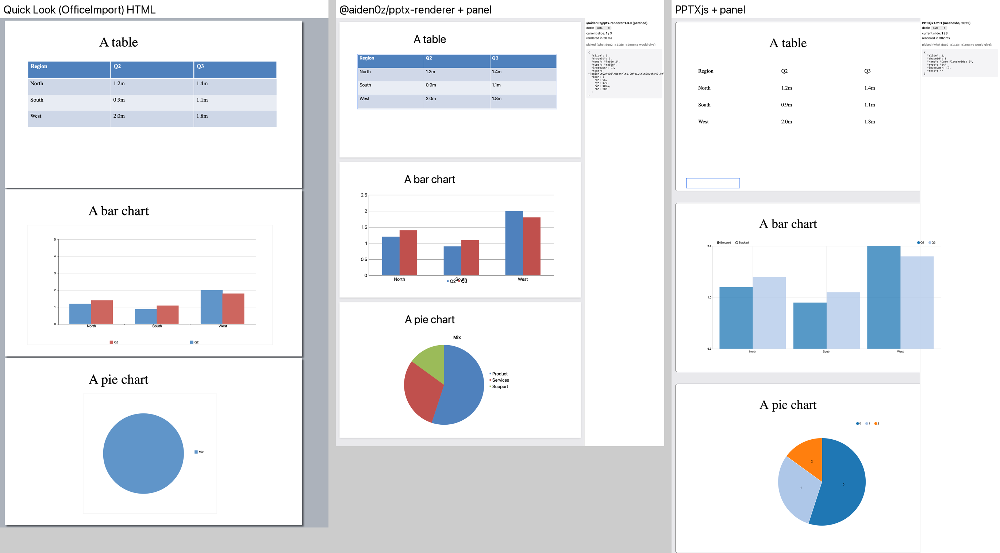
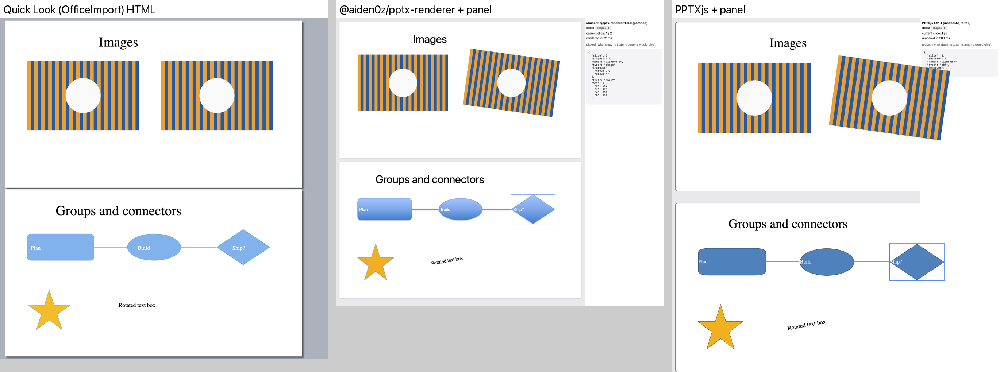
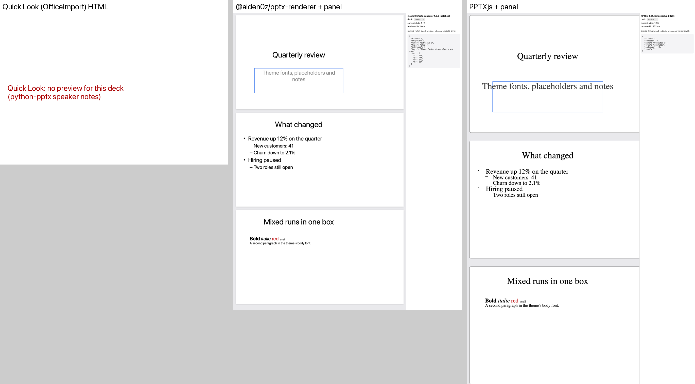
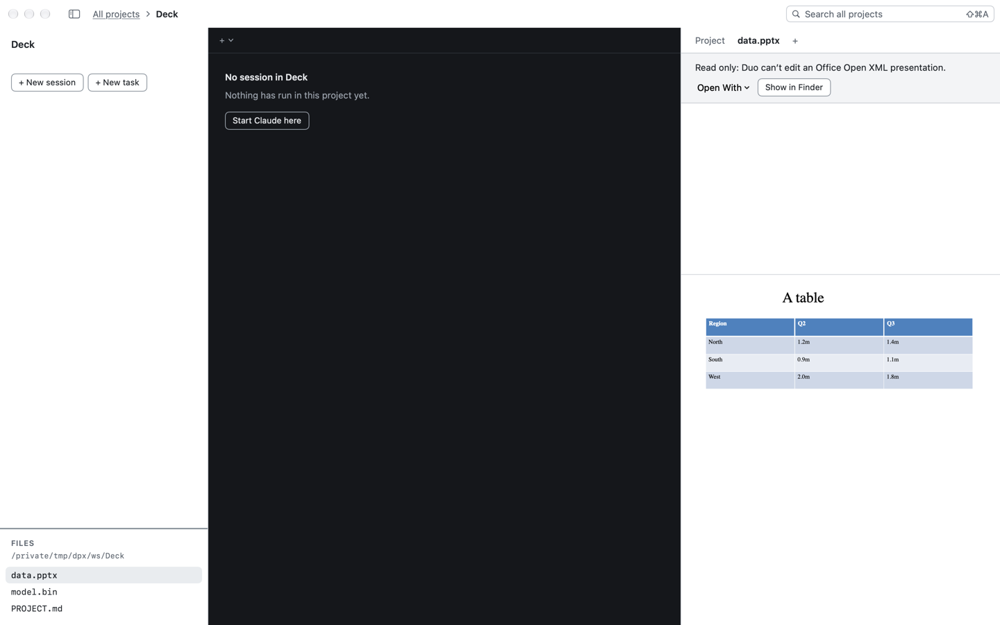
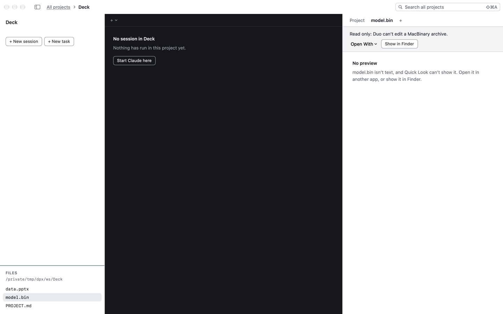
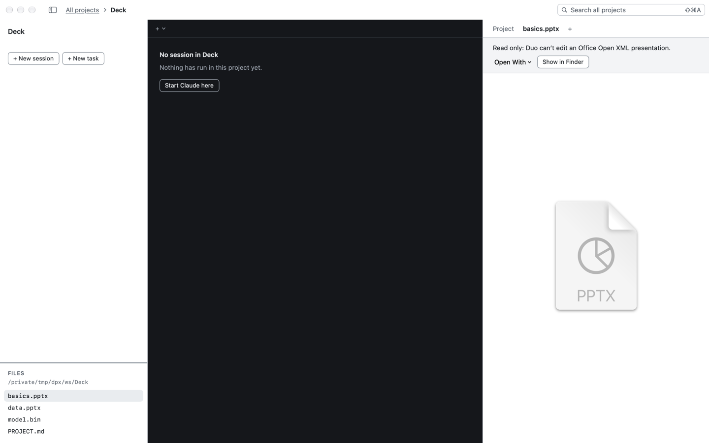

# Spike: a PowerPoint viewer in Duo (ENH-12)

Status: research done, waiting on Geoff's choice · 2026-10-06 · F-102 · Not v1 (build plan §3a)

**What v1 of the viewer must do:**
1. The user and the agent both see the deck.
2. Both know which slide is on screen.
3. The user can pick an element on a slide and send it to the agent, as `duo2 html pick|element` and `send element` do for HTML pages (F-72).

**Recommendation:** render with **`@aiden0z/pptx-renderer`** (Apache-2.0, maintained, 1.8 MB, fully offline) in a WKWebView, with the same picker plumbing as HTML pages.
- A four-line patch stamps each shape's element with its OOXML id.
- `duo2` reads slides straight from the file's XML, so a picked element and the agent's outline name the same shape.
- Effort: about **M**, plus a design pass (the viewer is a new surface).
- Until then, Quick Look in the right pane shows decks read-only (C-26).

## How the options compare

Tested on three python-pptx decks (`Spikes/PptxViewer/make_decks.py`):
- **basics:** title and bullets, theme fonts, mixed runs, speaker notes.
- **data:** a table, a clustered bar chart, a pie chart.
- **shapes:** two images (one rotated), a group inside a group, connectors, a star, a rotated text box.

PowerPoint isn't on this Mac, so the reference is Apple's own Office renderer (Quick Look's OfficeImport). It isn't ground truth either: see its column.

| | **@aiden0z/pptx-renderer 1.3.0** (WKWebView) | PPTXjs 1.21.1 (WKWebView) | Quick Look (`QLPreviewView`) | LibreOffice headless → PDF/SVG | Our own OOXML parsing |
|---|---|---|---|---|---|
| **Fidelity on the test decks** | Best of those tried. Theme colours and gradients, rotation, nested groups, the table style, both charts (ECharts). One flaw: the bar chart's legend overlaps the category labels. Calibri falls back to the system sans (not installed on a Mac without Office). | Fair. Rotation is right, but there's no table style (plain text grid), Times in place of the theme fonts, no gradients, an empty date placeholder drawn as a box, nv.d3 charts with stray "Grouped/Stacked" controls, a pie legend labelled 0 1 2. Slides don't fit the pane width. | Good where it works. Apple's renderer: tables, charts and images. Drops picture and text-box rotation, draws the pie as one solid disc, uses Times for Calibri. **No preview at all for a deck with speaker notes written by python-pptx** (it shows the file icon). | High (real Office layout engine). Not run here: not installed. | None; not a renderer |
| **Unsupported here** | EMF/WMF vector art beyond embedded previews (needs optional pdf.js), video playback. Claims SmartArt and equations. | SmartArt partial, charts dated, no text autofit | — | Animations | — |
| **License** | Apache-2.0 (bundles JSZip MIT/GPL dual, ECharts Apache-2.0) | MIT (jQuery, JSZip, d3 v3, nv.d3) | System | MPL-2.0 (some LGPLv3+) | Ours |
| **Maintenance** | Active: v1.3.0 2026-09-14, regression-tested against PowerPoint renders | Dormant since March 2022 | Apple | Active | Ours |
| **Size** | 1.8 MB, one ES module | 1.3 MB, six files | 0 | ~285 MB DMG, ~1 GB installed (unverified) | 0 (Swift) |
| **Selection and identity** | **Yes, after a four-line patch** (`Spikes/PptxViewer/patch-aiden0z.py`): every shape, picture, table, chart and group element gets `data-duo-shape-id` (the `p:cNvPr` id), its name and its type, nested groups included. Clicking the diamond inside two groups gave `{slide 2, shapeId 7, "Diamond 6", inGroups [Group 2, Group 4], "Ship?", box 912,173 230×154}`. The OOXML outline gives the same id, groups and box. Unpatched, ids live only in its model. | Partial. Shapes carry `_id`/`_name` out of the box, but tables and charts don't, groups aren't nested in the DOM, the id sits on an `<svg>` whose text is a sibling (picked text came back empty), and layout placeholders are drawn and clickable with their layout's ids. | **No.** No hit-testing, no selection, no element API. | No (pictures; ids are lost) | Gives ids, text and boxes for the agent; nothing to click on |
| **Active slide** | Yes: its `slidechange` event and `currentSlideIndex`, plus `goToSlide(n)`; an IntersectionObserver works too | IntersectionObserver over `.slide` (no API of its own) | **No.** `QLPreviewView` has no page index (`displayState` is opaque). | Only if we draw the pages ourselves (PDFKit) | n/a |
| **Offline / sandbox** | Fully offline; the file is read as bytes and nothing loads from the network; one `blob:` worker only for the optional pdf.js | Offline. Loads the deck over XHR, so it needs a URL the page may fetch. | Offline | Offline once installed | Offline |
| **Work Mac (no admin, proxy; C-1)** | Ships inside Duo.app: nothing to install, no network | Same | Built in | Needs its own app (≈1 GB) and a user-folder install outside management; heavy to require | Built in |
| **Speed** | ~20 ms per test deck after load; lazy slides and media for big decks | ~300 ms | Fast | Seconds per deck | Fast |

**Not shortlisted:**
- `pptx-preview`: closed source behind an npm ISC label.
- `pptxviewjs`: canvas only, so no DOM to pick.
- `@kandiforge/pptx-renderer`: UNLICENSED, and the repo is gone.
- ONLYOFFICE sdkjs: AGPL, canvas.
- `pptx2html`: abandoned 2017; PPTXjs is its fork.
- ZetaOffice (LibreOffice in WASM): about 47 MB, needs cross-origin isolation, CDN gone.
- Keynote through AppleScript: needs Keynote, and an Automation prompt (F-54).
- `pptx-viewer` (MIT, 418 KB, SVG) is the lighter fallback if 1.8 MB matters. It also keeps ids only in its model, so it would need the same kind of patch; not prototyped.

## What the proofs of concept show

`Spikes/PptxViewer/`. Run `./fetch-vendor.sh`, then `python3 -m http.server 8777 --directory Spikes/PptxViewer`, and open `/aiden0z.html?deck=shapes` or `/pptxjs.html`.
- **The pages:** each renders a deck, shows the current slide, and on a click shows (and posts to `window.webkit.messageHandlers.duo`) what `duo2 slide element` would return.
- **`snap.swift`** drives either page in a real WKWebView, clicks a shape from script and snapshots the page. The shots below come from it.
- **`pptx_outline.py`** is the agent's side: slide N's shapes (id, name, type, groups, text, box), table cells, chart type and series values, and speaker notes, from the zip with the standard library.

Reference, then the two renderers with their panels, per deck:

**Things the shots show:**
- **Quick Look:** loses the rotation and the pie's colours, and gives nothing for `basics` (speaker notes).
- **aiden0z:** gets all three decks; the picked shape is outlined and described in the panel.
- **PPTXjs:** a plain table, odd chart controls, slides clipped by the panel.

## The recommendation in Duo terms

- **Human side:** a `.pptx` tab hosts the renderer in a WKWebView, as local HTML does (`HTMLViewer`/`PageHost`, F-72). Slides scroll vertically; the slide on screen is shown in the tab's bar. Bundle the patched module in `Resources/` (Apache-2.0 notice in the about box). The deck is passed as bytes, so no file URL access is needed.
- **Picking:** `PageHost`'s picker already outlines and posts elements. For decks the payload is `{file, slide, shapeId, name, type, inGroups, text, box}`, and `send element` formats it for Claude as slide N, shape "Diamond 6" (id 7), "Ship?".
- **Agent side (Swift, no renderer):**
  - New `duo2` verbs: `duo2 slide` (the slide on screen), `slide go <n>`, `slide shapes [n]` (the outline), `slide element` (the picked shape), `slide notes [n]`.
  - Foundation can't unzip. Options: a small reader for a zip's central directory with Compression's raw deflate, `/usr/bin/unzip` through `Process`, or a vendored ZIPFoundation (MIT). The parsing itself is about 150 lines (the Python proof is 100).
- **Same ids both ways:** the renderer stamps `p:cNvPr` ids and the outline reads them, so Claude can answer "the diamond on slide 2" and later edit that exact shape with python-pptx.
- **Edits on disk:** when Claude rewrites the deck, the tab reloads (as HTML pages do on change) and keeps the slide.

**Risks:**
- The patch matches the bundle's node dispatcher by shape; an upgrade can move it. `patch-aiden0z.py` fails loudly, and the alternative is a hit-test against the model's node bounds (no patch).
- Placeholders without their own position get their box from the layout. The outline reports none for them today, so it needs the layout inheritance.
- Theme fonts like Calibri aren't on a Mac without Office. The renderer loads embedded fonts but otherwise falls back.
- Fidelity on real-world decks (SmartArt, EMF art, masters) needs a check on a few of Geoff's own decks before committing.

**Effort:** M. Viewer tab plus bundle: S. Picker payload and `send element`: S, reusing F-72. OOXML reader and five `duo2` verbs with checks: M. Design pass: the tab's bar, the slide indicator, the picked outline.

## Part 1 (C-26), for reference

Binary files no longer open in the editor. Quick Look is the stand-in viewer (Q-52):

