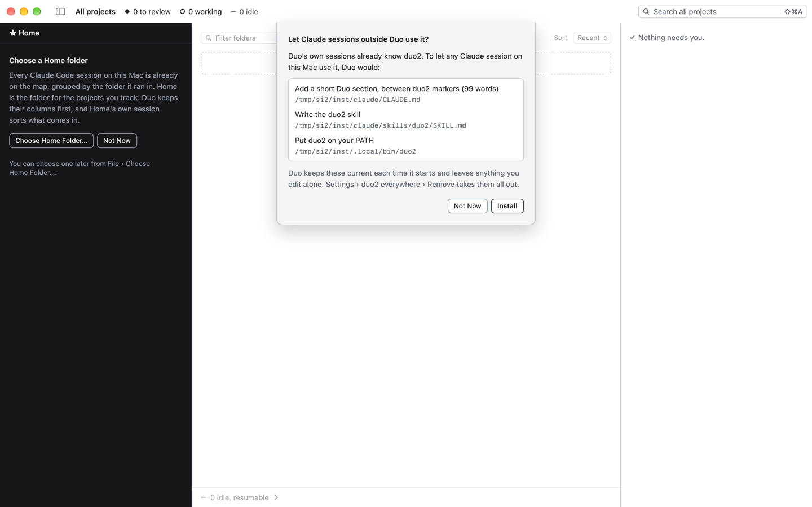

# Spike: scripted Duo instances re-ask the first-run questions

Status: done · 2026-10-06 · F-107, C-28 · research only, no app code changed

Geoff (2026-10-06): "many sessions are spawning fresh instances of duo -- each has no state and is reasking the installation questions; this may be fine, but please look into this."

## Answer in short

- **The re-asking is real, and it comes from the C-21 guard working as designed.** A scripted run gets an empty support folder (a fresh `/tmp/duo-XXXXXX`, or a session's own `DUO_SUPPORT_DIR`). The install consent lives in that folder (`Duo/installed.json`), so every such instance asks "Let Claude sessions outside Duo use it?" again.
- **It isn't harmless.** The question's targets are *not* in the support folder. `~/.local/bin/duo2` is always Geoff's real one, and the CLAUDE.md block and skill are his real ones unless the run also sets `CLAUDE_CONFIG_DIR`.
- **It already happened today (C-28).** At 10:49 a build session's test instance installed into Geoff's home. `~/.local/bin/duo2` now points into another session's work tree (`.claude/worktrees/session-task-context/build/Duo.app/…/duo2`). It breaks when that work tree is removed.
- **The question also steals focus.** `SheetCenter.ask` calls `NSApp.activate(ignoringOtherApps: true)`, and **Install** is the default button. So one Return, typed into whatever Geoff was using, installs.
- **Capture runs are not the problem.** `check-ui.sh`, `run-live.sh` and every `--capture`/`--capture-window` run skip the launch questions (`DuoApp`: `!options.capturing`). The ones that ask are the non-capturing runs: `open -n build/Duo.app --args --workspace …` with no `--capture`, which sessions use to drive an instance with `duo2`.

## 1. Reproduction

All runs used `build/Duo.app` from `main` (4135cb3) and a scratch `CLAUDE_CONFIG_DIR`. Every instance was quit with SIGTERM to its own pid. No question was answered.

| Run | Launch | Support folder | What appeared | Blocks? |
|---|---|---|---|---|
| A | `open -n build/Duo.app --args --workspace /tmp/si1/ws` (no `--capture`) | none given → `/tmp/duo-7xYXau` (stderr names it) | A window comes forward on Geoff's screen. After ~1 s it shows the install sheet: "Let Claude sessions outside Duo use it?", **Install** default. The left pane shows the inline "Choose a Home folder" card (not modal). | No. `duo2 status` against the instance's socket answered while the sheet was up. `installed.json` stays absent until someone answers, so the next launch asks again. |
| B | as A + `DUO_INSTALL_ROOT=/tmp/si2/inst` + `--capture-window … --then wait×6` | none → `/tmp/duo-1UbpNb` | The same sheet, with every path under the install root (`scripted-instances-install-sheet.png`). | No. All six `--then` steps ran and the capture was written with the sheet up: it is a SwiftUI sheet, not a modal run loop (F-54 holds). |
| `check-ui.sh` / `run-live.sh` (code read + 95 temp folders from today) | `--capture` / `--capture-window` | temp | Nothing. `interactivePrompts = false`, and InstallPrompt is skipped unless `DUO_INSTALL_ROOT` is set. None of the 97 `/tmp/duo-XXXXXX` folders has an `installed.json`. | n/a |

What a fresh folder can ask at launch, and when:

| Question | Where | Asked in a non-capturing scripted run? | Writes where |
|---|---|---|---|
| Install duo2 everywhere (DL-74/75) | `InstallPrompt.run`, 1 s after launch | **Yes, every launch** (consent is per support folder). Ignores `DUO_AUTOCONFIRM`. | `~/.local/bin/duo2` (always real home); `$CLAUDE_CONFIG_DIR` or `~/.claude` for CLAUDE.md and `skills/duo2` |
| Legacy Duo still teaching Claude | `LegacyPrompt.run`, after the install answer | Only if legacy files are found in `$CLAUDE_CONFIG_DIR`/`~/.claude`. Its "Not Now" lives in the support folder, so it re-asks too. | Disable edits `~/.claude/settings.json` and `CLAUDE.md` (backup goes to the temp folder, then is lost) |
| Keep `.duo/` out of git | `GitIgnoreOffer` | Yes, for workspace projects in a git repo, unless `DUO_GITIGNORE_ANSWER` is set | The repo's `.gitignore` (inside the workspace, fine) |
| Choose a Home folder | inline card, left pane | Shown, not modal | the support folder |
| Notifications permission | first `needsYou` | No under `DUO_AUTOCONFIRM`; otherwise possible | system (per bundle id, shared) |
| Sparkle | `SparkleUpdater.start` | No: dev builds (0.0.1) and `DUO_AUTOCONFIRM` skip it. A *release* build launched with `--workspace` and no `DUO_AUTOCONFIRM` would start it. | Sparkle's defaults (per bundle id, shared) |

## 2. Who launches them

Live at 10:53 (ps, with each process's environment):

| pid | Launched by | Command | Support folder | Notes |
|---|---|---|---|---|
| 22756 | session `e0127e51` (via `scripts/acceptance/open-duo.sh`) | `build/Duo.app … --workspace ~/DuoAcceptance/workspace` | **real** (`DUO_SUPPORT_DIR=~/Library/Application Support`) | **Geoff's own Duo.** It is a scripted-flag launch that opts into the real folder, so any fix must key on the *folder*, not the flags. It quit at ~10:55; this spike didn't touch it. |
| 78940 | session `b04dc5aa` (session-task-context build) | worktree `build/Duo.app --workspace /tmp/dtc/ws`, no capture, `DUO_AUTOCONFIRM=1`, `CLAUDE_CONFIG_DIR=/tmp/dtc/cfg` | `/tmp/dtc` (explicit) | **The instance that relinked Geoff's duo2 (C-28).** The session's own `kill -TERM` and its relink were both refused by the auto-mode classifier. Still running at 10:58. |
| 86882 | session `3e9f10b7`, its `run.sh` | `--workspace … --capture-window … --then wait×60` | `/tmp/tm/s` (explicit) | A well-behaved capture run. |

Across the last 36 hours of transcripts in this project, the non-capturing launches since F-89 come from `b04dc5aa` and `77727c75` (both with an explicit `DUO_SUPPORT_DIR`). Every other launch was a capture run. A long-running session (`08dceb97`) has 30-odd bare `MacOS/Duo --workspace` and plain `MacOS/Duo` launches, but they date from 3 October, before F-89.

The 97 `/tmp/duo-XXXXXX` folders since 5 October 12:28 come in batches of six in the same minute, which is `check-ui.sh` doing its states. They are captures and asked nothing. They are never cleaned up (each is small).

Inherited environment: instances launched from a session in Geoff's Duo inherit **his** `DUO_SOCKET`/`DUO_TOKEN`. This is harmless today: the instance listens in its own folder, and `Terminals` overwrites both for its children. But a session's `duo2`, run beside its test instance without re-exporting **both** variables, reaches Geoff's Duo (as CLAUDE.md warns).

## 3. Risks

**Writes outside the support folder (C-28: high).** `Installer`'s manifest is in the support folder, but its targets aren't:

- `link` is `~/.local/bin/duo2` unless `DUO_INSTALL_ROOT` is set;
- `claudeMD` and `skillFile` follow `CLAUDE_CONFIG_DIR`, otherwise `~/.claude`.

So a scripted instance that gets one "Install" writes into Geoff's home:

1. **Relinks `~/.local/bin/duo2` to its own build.** It's often a work tree that will be deleted, or a build of a different protocol. This happened at 10:49 today. Every Claude session outside Duo then runs that duo2. It is fixed only when Geoff's own Duo next launches: `install` relinks a link that points at any `.app/Contents/Helpers/duo2`.
2. **Bypasses the user-edit guards.** A fresh manifest has no `blockHash`/`skillHash` and `blockRemovedByUser = false`. So without `CLAUDE_CONFIG_DIR` it would:
   - overwrite a duo2 skill Geoff edited;
   - re-add a CLAUDE.md block he removed (DL-74's "never added back");
   - write that build's skill text, which may list verbs that build has and his Duo doesn't.
3. **`duo2 uninstall`/Settings › Remove in an instance** removes the real files (the hash checks pass because the text matches).
4. **LegacyPrompt › Disable** would rewrite `~/.claude/settings.json` and `CLAUDE.md`, and put its backup in a temp folder that's later deleted. That's only if legacy files are present and `CLAUDE_CONFIG_DIR` isn't set.

How consent was given at 10:49 isn't recorded. `b04dc5aa`'s first launch (pid 78263, alive ~10 s) recorded `consented: true`, and its second launch installed silently. The session sent no `answer:` action. The likeliest path is a Return keystroke reaching the sheet after it took focus.

**Shared between concurrent instances:**

- **`~/.local/bin/duo2`:** the last launch that installs wins. Geoff's Duo doesn't notice until it relaunches.
- **The CLAUDE.md block and skill:** only when `CLAUDE_CONFIG_DIR` isn't scratch. Different builds generate different skill text, so they flip it back and forth.
- **`UserDefaults` (`com.dudgeon.duo`):** shared by every instance. Today that means search recents (`SearchRecents`): a test's searches show up in Geoff's Search empty state. Also WebKit spelling defaults, and Sparkle's keys if a release build ever runs scripted.
- **Notifications and the Dock badge:** per bundle id. A non-capturing instance without `DUO_AUTOCONFIRM` could post notifications that look like Geoff's.
- **Sockets, endpoint, hooks:** not shared. Each is inside the support folder (`duo.sock`, `endpoint.json`, per-session `--settings` files in `events/`); nothing goes into `~/.claude/settings.json`.
- **Ports:** none.

**Focus and screen:** every `SheetCenter.ask` activates the app over Geoff's work, and every instance has a Dock icon and a window. Capture runs show a window briefly; non-capturing runs stay up until killed, and 78940 is still up.

## 4. Recommendation

In order. The first two fix the report and C-28.

1. **An isolated instance never asks the launch questions and never writes outside its own folders.** Key it on the folder, not the flags: the instance is isolated when the effective support folder isn't the real Application Support. That keeps Geoff's acceptance Duo, which is `--workspace` plus the real folder, behaving as his. In an isolated instance:
   - **InstallPrompt** neither asks nor refreshes unless `DUO_INSTALL_ROOT` is set. The walks and checks that exercise the first-run flow already set it, so they keep working, and their paths stay inside the install root.
   - **LegacyPrompt** runs only with a scratch `CLAUDE_CONFIG_DIR` or `DUO_INSTALL_ROOT`.
   - **`duo2 install`/`uninstall` and Settings › duo2 everywhere** refuse, unless `DUO_INSTALL_ROOT` is set, with a line saying why.
   - **Defence in depth:** `Installer.install` refuses a link target that isn't the running app's own `Helpers/duo2` *and* refuses to touch the real home from an isolated instance. A DuoChecks case asserts this.

   Cost: small. It's one predicate, `SupportFolder.isIsolated`, plus three guards. It changes nothing for Geoff's real launches.
2. **An isolated instance never takes focus.** `SheetCenter.ask` (and the other `activate(ignoringOtherApps:)` calls) skip activation when isolated. The sheet still shows in that instance's window for anyone looking, but Return in Geoff's terminal can't answer it. I'd keep the Dock icon. Sessions that drive an instance with computer-use need a normal app, and `.accessory` changes window behaviour enough to make captures unrepresentative. An opt-in `DUO_BACKGROUND=1` (activation policy `.prohibited` for captures) is a cheap later step if windows flashing up still bothers Geoff.
3. **Housekeeping, not urgent:**
   - Move search recents from `UserDefaults` into the support folder.
   - Have `SupportFolder` delete temp folders older than a day at launch.
   - Add to CLAUDE.md's "Running the app": a non-capturing instance is quit by the session that started it before it ends its turn.
4. **Not recommended: a shared pre-seeded "scripted" template folder.** Once 1 is in, there's nothing to pre-seed, and a shared template is one more shared, mutable thing for concurrent runs to fight over and to drift from what a fresh install sees.

**Now, before any code:** quit 78940 (session `b04dc5aa`'s instance; its own kill was refused). Then put `~/.local/bin/duo2` back. Relaunching Geoff's Duo does it, or he can run `ln -sfh ~/repos/duo-v2/build/Duo.app/Contents/Helpers/duo2 ~/.local/bin/duo2`. Geoff's `~/.claude/CLAUDE.md` (last changed 4 October) and `~/.claude/skills/duo2` (written by his own Duo at 07:39) were not touched: that session used a scratch `CLAUDE_CONFIG_DIR`.
